# Guaardvark

**Version 2.6.0** · [guaardvark.com](https://guaardvark.com)

The self-hosted AI workstation. Autonomous agents that see your screen and control your apps. A three-tier neural routing engine. Parallel agent swarms across isolated git worktrees. Video generation, image upscaling to 4K/8K, RAG over your documents, voice interface, and a 60+ tool execution engine — all running locally on your hardware. Your machine. Your data. Your rules.

## What's included

A full creative-professional AI workstation, all running locally:

**Generation**
- **Video (Text-to-Video, Image-to-Video)** — Wan 2.2, CogVideoX 2B/5B, SVD-XT. No workflow graph required: paste a list of prompts, pick a model and resolution, hit go. The queue handles the rest while you start the next batch.
- **Audio Studio** — music generation (ACE-Step, full songs with vocals or instrumental), sound-effect lab (Stable Audio Open), neural voice (Chatterbox + Kokoro), and 6 Piper voice profiles out of the box.
- **Voice Cloning** — gated behind an explicit consent prompt before any clone is created or used.
- **Image generation** — Stable Diffusion via Diffusers with batch queue, face restoration, anatomy and detail controls.
- **Image + Video Upscaling** — 4K and 8K via HAT-L, RealESRGAN family, NMKD-Superscale, Foolhardy Remacri. Two-pass mode for maximum quality. Frame-by-frame video processing.
- **Batch CSV Generator** — generate unique web pages, post content, or structured data from a CSV using your indexed knowledge base as ground truth. Marketing copy, product pages, unique-content campaigns at scale.
- **File Generation** — code, text, docs, images, video, audio in one queue.

**Editing**
- **Video Editor** — Shotcut-lite timeline with three lanes (video / text / audio), drag-and-drop from the media library, real text overlay rendering via ffmpeg, visual trim sliders, keyboard shortcuts, one-step undo.
- **Video Text Overlay** — standalone tool for the simpler one-off case.

**Agents & Automation**
- **Autonomous screen agents** — agents see a real virtual desktop (Xvfb :99), move the mouse, click, type, navigate browsers, and verify their own actions.
- **AgentBrain** — three-tier neural routing: Reflex (<100ms), Instinct (1–3s), Deliberation (5–30s).
- **Agent Training System** — visual hand-eye-coordination teaching: bracket a session with Begin/End Lesson, walk the agent through a flow with thumbs-up pearls, the system distills a structured replayable lesson with parameterized steps.
- **Agent Memory + Learning** — system-message persistent knowledge that survives reboots, recipe induction from successful tasks (Agent Workflow Memory pattern), vision-actionable knowledge with no cached pixel coordinates.
- **Agent Swarms** — up to 20 parallel coding agents, each in an isolated git worktree on its own branch. Dependency-ordered merging. Flight Mode (fully offline). Backends: Claude Code, Cline/OpenClaw via local Ollama.
- **Agents · Agent Tools · Virtual Agent Screen** — explorable surfaces for each capability, with a draggable VNC viewer that works on any page.
- **Voice Chat** — Whisper.cpp transcribes, the agent thinks, Piper speaks. Toggle with `/voice`.
- **Outreach System** — supervised AI for social-media engagement (Reddit, Discord, Twitter/X, Facebook) grounded in your indexed knowledge. Full detail below.
- **Self-Improvement** — detects test failures, dispatches an agent to read the offending code and fix it, verifies, broadcasts to other instances. Optional Anthropic-API guardian review.
- **Auto Researcher** — autonomous RAG-pipeline optimizer that experiments with parameters, keeps wins, reverts losses.

**Workflow Surfaces**
- **File Manager** — drag from your real desktop into the in-app File Manager. Color-code files, copy & paste, drag-and-drop reorganize. Folder / List / Media views. Right-click menus (copy, paste, delete, recursive index). Files attach to clients, projects, websites, notes, or code repos.
- **Notes Manager** · **Media Manager** · **Project Management** · **Client Management** · **Websites Management** — consistent grid+detail UI for the working surfaces a small business actually uses. Cross-linked: documents attach to projects attach to clients attach to websites.
- **Dashboard** — live status grid: model health, GPU usage, RAG state, agent activity, plugin states.
- **Code Editor** — Monaco-based IDE with right-click "explain", "fix", "generate" via the AI assistant.
- **Code Analyzer · Code Repos** — repo-level understanding and per-repo indexing.
- **Task Scheduler** — cron-style scheduling for any agent task or generation job.
- **Rules & Prompts** — import/export rules and prompts as a portable bundle.

**Integration**
- **ComfyUI Backend** — managed as a plugin, used as the execution layer for advanced video pipelines.
- **WordPress Connectivity** — push generated content directly into a WordPress site via a companion plugin. Functional today; ships with security disclaimers and a finishing-pass on the roadmap before the plugin moves out of beta.

**Platform**
- **Plugin System** — every heavy capability (ComfyUI, Vision Pipeline, Audio Foundry, Upscaling, Discord, Swarm) is a managed plugin with health monitoring, port-based orphan cleanup, and a **System Resource Orchestrator** that arbitrates VRAM between them so two big models don't fight for the GPU.
- **CPU Offload** for models that don't fit in VRAM.
- **GPU + CPU Resource Monitor** — live, always visible.
- **Interconnector / Cluster** — install Guaardvark on multiple local machines, master/client architecture with approval workflows, automatic load balancing across the fleet, hardware profile auto-detection.
- **Model Management** — download voice/video/image models from HuggingFace with progress tracking. Quick-switch between local Ollama models. Quick-switch embedding models grouped by parameter count.
- **Backup & Restore** — granular or full system backup, schema-migration-aware restore, cross-version compatible.
- **Advanced Settings** — debugging toggles, RAG knobs, cache controls, diagnostic tools, test runners, self-improvement controls — exposed in the UI, not hidden behind a "config files only" wall.

<p align="center">
  
</p>

<p align="center">
  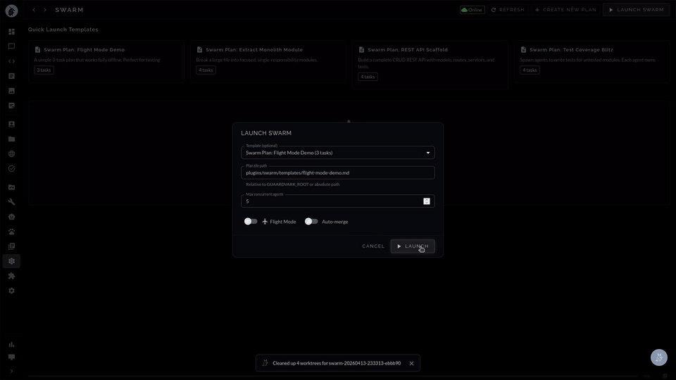
  <br>
  <em>Agent Swarm — parse a plan, spawn parallel agents in isolated git worktrees, resolve the dependency DAG, merge back to main.</em>
</p>

[](LICENSE)
[](https://github.com/guaardvark/guaardvark/actions/workflows/ci.yml)
[](https://pypi.org/project/guaardvark/)
[](https://github.com/guaardvark/guaardvark/stargazers)
[](https://github.com/guaardvark/guaardvark/issues)
[](https://github.com/sponsors/guaardvark)

```bash
git clone https://github.com/guaardvark/guaardvark.git && cd guaardvark && ./start.sh
```

One command. Installs everything. Starts all services. Done.

### AI-Generated Film — Made Entirely with Guaardvark

Every frame generated on a single desktop GPU. No cloud. No stock footage. No API keys.

[](https://www.youtube.com/watch?v=8MdtM3HurJo)

---

## What Makes This Different

### AgentBrain — Three-Tier Neural Routing

Every message is routed through a three-tier decision engine that picks the fastest path to the right answer. Reflexes fire in under a millisecond. Instinct handles single-shot requests in one LLM call. Deliberation spins up a full ReACT reasoning loop when the problem demands it.

| Agent Control | Agent Tools |
|:-:|:-:|
| 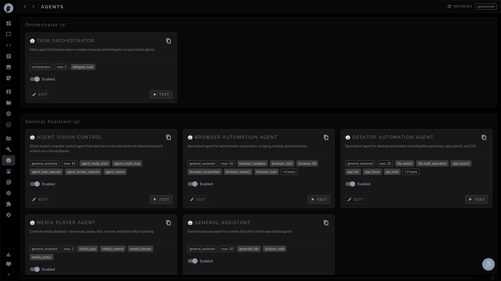 |  |

| Tier | Name | Latency | LLM Calls | When It Fires |
|------|------|---------|-----------|---------------|
| 1 | **Reflex** | <100ms | 0 | Greetings, farewells, media controls — pattern-matched, no inference |
| 2 | **Instinct** | 1–3s | 1 | Single-shot questions, web searches, image generation, vision tasks |
| 3 | **Deliberation** | 5–30s | 3–10 | Multi-step research, analysis chains, complex agent tasks |

- **Automatic escalation** — Tier 2 can signal complexity and hand off to Tier 3 mid-response
- **Agent-screen gating** — when the virtual screen isn't being viewed, vision models fall through to the normal ReACT loop with the full tool registry instead of always trying to drive the screen. Click and type tools only appear when a user actually has the agent screen open.
- **BrainState singleton** — pre-computes tool schemas, model capabilities, system prompts, and reflex tables at startup so routing adds zero overhead
- **Warm-up** — background thread loads the active model into VRAM before the first request arrives

### Autonomous Screen Agents

Guaardvark agents control a real virtual desktop (Xvfb + openbox at 1280x720). They see the screen through vision models, move the mouse, click buttons, type text, navigate browsers, and verify their own actions.

- **Unified vision brain** — Gemma4 sees the screen and decides the next action in a single inference call. Qwen3-VL handles coordinate estimation. Both calibrated per-model with tracked scale factors.
- **Closed-loop servo targeting** — three-attempt adaptive strategy: ballistic move → single correction with crosshair overlay → full corrections with zoom-cropped analysis around the cursor
- **45+ deterministic recipes** — browser navigation, tabs, scroll, search, find, zoom, copy/paste — all execute instantly from a JSON recipe library, bypassing the vision loop entirely
- **Obstacle detection** — handles popups, permission dialogs, and notification bars with automatic thinking model escalation
- **Self-QA sweep** — agent navigates every page of its own UI and reports what's working and what's broken
- **Live agent monitor** — real-time SEE/THINK/ACT transcript of every decision the agent makes
- **Integrated screen viewer** — draggable, resizable VNC viewer on any page with popup window mode

#### Supported Vision Models

| Model | Role | Coordinate System | Notes |
|-------|------|-------------------|-------|
| Gemma4 (e4b) | Sees + decides | 1024x1024 normalized, box_2d `[y1,x1,y2,x2]` | Unified brain — vision and reasoning in one call |
| Qwen3-VL (2b) | Coordinate estimation | 1024px internal width | Default servo eyes, fast and accurate on dark UIs |
| Qwen3-VL (4b/8b) | Escalation eyes | 1024px internal width | Automatic escalation after 3 consecutive failures |
| Moondream | Fallback eyes | 1024px internal width | For text-only models that need external vision |

### Swarm Orchestrator — Parallel Agent Execution

Launch multiple AI coding agents in parallel, each working in an isolated git worktree on its own branch. Results merge back with dependency-ordered conflict detection, optional test validation, and full cost tracking.

- **Two backends** — Claude Code (cloud, cost-tracked at $0.015/$0.075 per 1K tokens) and Cline/OpenClaw (fully local via Ollama, zero cost)
- **Flight Mode** — fully offline operation. Auto-detects network state, falls back to local models, serializes file conflicts automatically. No prompts, no internet required.
- **Git worktree isolation** — each task gets its own branch and working directory. All worktrees share the `.git` directory (lightweight). Automatically excluded from `git status`.
- **Dependency-aware merging** — topological sort ensures foundational changes land first. Dry-run conflict detection before real merge. Test suite validation before integration.
- **Built-in templates** — REST API scaffold, refactor-and-extract, test coverage expansion, Flight Mode demo
- **Up to 20 concurrent agents** — configurable limit with automatic slot management
- **Live dashboard** — real-time status, per-task logs, cost breakdown, elapsed time, disk usage

### Video Generation Pipeline

State-of-the-art video generation running entirely on your GPU. No cloud APIs, no per-minute billing, no content restrictions.

| Video Generation | Plugin System |
|:-:|:-:|
| 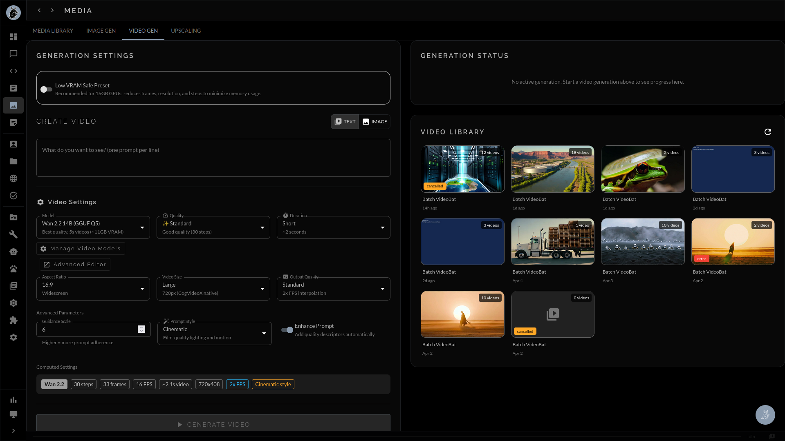 |  |

| Model | Type | Max Duration | Native Resolution | VRAM |
|-------|------|-------------|-------------------|------|
| **Wan 2.2 (14B MoE)** | Text-to-Video | 5s (81 frames @ 16fps) | 832x480 | 11GB |
| **CogVideoX-5B** | Text-to-Video | 6s (49 frames @ 8fps) | 720x480 | 16GB |
| **CogVideoX-2B** | Text-to-Video | 6s (49 frames @ 8fps) | 720x480 | 12GB |
| **CogVideoX-5B I2V** | Image-to-Video | 6s (49 frames @ 8fps) | 720x480 | 16GB |
| **SVD XT** | Text-to-Video | 3.5s (25 frames @ 7fps) | 512x512 | <8GB |

- **Resolution options** — 512px, 576px, 720px, 1280px, 1920px (1080p), and custom dimensions (multiples of 8)
- **Quality tiers** — Fast (10 steps), Standard (30), High (40), Maximum (50)
- **Frame interpolation** — 1x raw, 2x doubled FPS, 2x + upscale for cinema-quality output
- **Prompt enhancement** — Cinematic, Realistic, Artistic, Anime, or raw
- **Low VRAM mode** — automatically reduces resolution, frames, and inference steps for 8–12GB GPUs
- **Batch processing** — queue multiple videos from a prompt list, processed by Celery workers
- **ComfyUI integration** — one-click launch to the node editor for custom workflows

### Audio Studio — Music, FX, and Neural Voice

Three audio backends in one plugin with shared GPU-arbitration so they don't trample each other or fight Ollama for VRAM.

- **Music generation** — ACE-Step v1 (3.5B) for full songs with vocals or instrumental-only mode. Suno-style chip-prompt UX (Genre / Mood / Instrument) with optional LLM "Polish" pass that translates plain English into ACE-Step's tag vocabulary plus a paired negative prompt. ~10 GB VRAM at fp16.
- **FX Lab** — Stable Audio Open for sound effects and short ambient pieces. Light, fast, runs alongside other models.
- **Neural Voice** — Chatterbox as the primary TTS backend, Kokoro as a fast fallback, Piper for narration with 6 voice profiles included. Used for chat narration, voiceover for videos, and the voice-chat conversational mode.
- **Voice Cloning** — opt-in, gated behind an explicit consent prompt before any clone is created or used. Reference clips are kept under your control; the system never auto-clones from incidental audio.
- **Built-in audio player** — generated WAVs and MP3s open in an in-app player modal instead of triggering a browser download. Documents page surfaces audio rows with prompt, model, duration, and a waveform.
- **Suno export** — bulk-export a Suno library into the local DocumentsPage for use with the other generators.

### Video Editor — Shotcut-lite Timeline

A built-in non-linear editor for stitching generated clips, layering text, and rendering finished videos — without leaving the app.

| Lane | Holds | Source |
|------|-------|--------|
| **Video** | one clip per timeline (multi-clip tracking on the roadmap) | Media Library — drag-and-drop |
| **Text** | unlimited overlays, draggable on the preview, properties-panel for size/color/rotation | Add-Text button + properties editor |
| **Audio** | one music or voice clip | Media Library — Audio tab |

- **Visual trim slider** — Material UI range slider bound to source duration, two thumbs for start/end, live monospace readout. No more typing seconds into number inputs.
- **Tabbed icon-grid library** — three tabs (Video / Audio / Images) with counts in the tab labels. 36px tiles, drag from tile to matching timeline track.
- **Real text overlay rendering** — backend uses `ffmpeg drawtext` (9 named positions, optional outline + translucent box, proper escaping for colons/quotes/commas). Original is preserved.
- **Keyboard shortcuts** — space to play/pause, arrow keys to scrub, `t` to add text, `del` to remove selected, `cmd+z` for one-step undo.
- **JobOperationGate** — render path checks the gate before grabbing the GPU, so a render won't trample an active video generation or upscaling job.
- **Standalone Video Text Overlay tool** — for the simple one-off case where you don't need a timeline.

### GPU Image Upscaling — 4K and 8K Output

Upscale images and video frames to 4K (3840px) or 8K (7680px) resolution using GPU-accelerated super-resolution models.

| Model | Scale | Size | Best For |
|-------|-------|------|----------|
| HAT-L SRx4 | 4x | 159 MB | Maximum quality restoration |
| RealESRGAN x4plus | 4x | 64 MB | General-purpose, photorealistic |
| RealESRGAN x2plus | 2x | 64 MB | Mild upscaling |
| RealESRGAN x4plus (Anime) | 4x | 17 MB | Anime and stylized content |
| realesr-animevideov3 | 4x | 6 MB | Video-optimized anime |
| 4x-UltraSharp | 4x | 67 MB | Enhanced sharpness |
| 4x NMKD-Superscale | 4x | 67 MB | Advanced super-scaling |
| 4x Foolhardy Remacri | 4x | 67 MB | Texture-focused upscaling |

- **Two-pass mode** — run the model twice for maximum quality
- **Precision control** — FP16 (standard GPUs), BF16 (Ampere+), torch.compile for up to 3x speedup
- **Video upscaling** — frame-by-frame processing with progress tracking for MP4, MKV, AVI, MOV, WebM
- **Watch folder** — optional auto-processing of new files dropped into a directory

### RAG That Actually Works

Chat grounded in your documents. Upload files, build a knowledge base, and ask questions. The AI reads and understands your content — not just keyword matching.

| Chat with Agent Screen | Agent YouTube Search |
|:-:|:-:|
| 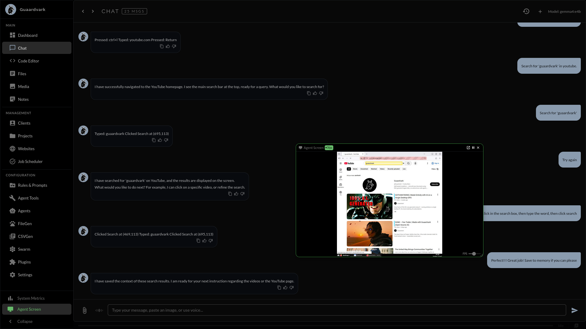 | 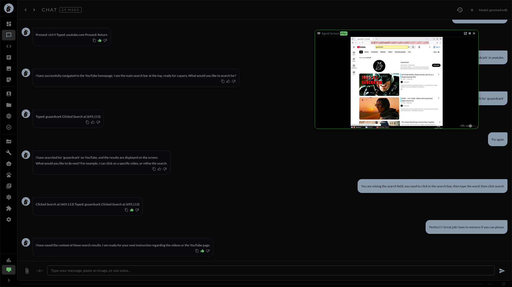 |

- **Hybrid retrieval** — BM25 keyword + vector semantic search combined
- **Smart chunking** — code files get AST-informed chunking, prose gets semantic splitting
- **Multiple embedding models** — switch between lightweight (300M) and high-quality (4B+) via UI
- **RAG Autoresearch** — autonomous optimization loop that experiments with parameters, keeps improvements, reverts regressions
- **Entity extraction** — automatic entity and relationship indexing
- **Per-project isolation** — each project has its own knowledge base and chat context

### Self-Improving AI

The system runs its own test suite, identifies failures, dispatches an AI agent to read the code and fix the bugs, verifies the fix, and broadcasts the learning to other instances. No human in the loop.

- **Three modes** — Scheduled (every 6 hours), Reactive (triggered by repeated 500 errors), Directed (manual tasks)
- **Guardian review** — Uncle Claude (Anthropic API) reviews code changes for safety before applying, with risk levels and halt directives
- **Verification loop** — re-runs tests after every fix to confirm it worked
- **Pending fixes queue** — stage, review, approve, or reject proposed changes
- **Cross-machine learning** — fixes propagate to all connected instances via the Interconnector

### Outreach System — Supervised AI for Social-Media Engagement

A supervised, auditable framework for drafting and posting authentic comments on Reddit, Discord, Twitter/X, and Facebook — using your own indexed knowledge as the source of truth for citations and context. The point isn't volume. It's keeping up with engagement on your own products and topics, with the agent handling the legwork.

**How it works**:

1. **Discover** — the agent scouts target threads either by URL (you paste one into the New Draft modal) or by walking platform-specific entry points (subscribed subreddits, Discord channels, Twitter feeds, Facebook groups).
2. **Context** — for each candidate post, the agent fetches the OP body and top comments. Reddit goes through the JSON API (fast, no scrape). Discord, Twitter, and Facebook go through the agent's logged-in Firefox session over CDP/BiDi, with a vision-model fallback when DOM selectors drift after a platform redesign.
3. **Draft** — your local LLM composes a reply grounded in the thread context plus citations from your indexed documents (clients, projects, products, examples — whatever you've fed the knowledge base).
4. **Grade** — every draft is scored against a relevance + quality rubric. Anything below threshold is dropped before it reaches the queue. Generic "great post!" replies don't survive grading.
5. **Review** — drafts land in a queue. In supervised mode (the default), nothing posts without your approval. Edit, save, approve, reject — your call on each one.
6. **Post** — approved drafts are posted via the platform's logged-in browser session, using a persona-shaped voice and a vision-driven send. Reddit posting is fully wired and verified end-to-end. Discord/Twitter/Facebook posting is in flight; drafting, queueing, and the supervised review surface already work for all four.

**Three layers of safety**:

- **Kill switch** at the system level. Flip it off and every outreach pipeline — drafting, queueing, posting — stops mid-flight. Nothing escapes.
- **Supervised mode** is the default. Drafts queue, never auto-post. You approve each one explicitly.
- **Cadence gates** — at most 1 post per 30 minutes per platform, configurable. Prevents bot-shaped behavior and respects platform anti-spam expectations.

**Audit log** — every action (scout, draft, grade, approve, reject, post, fail) is recorded in a JSONL audit trail with timestamps, draft IDs, and outcomes. Exportable for compliance or post-hoc review.

**Persona system** — a single configurable persona (voice, expertise areas, citation style, what to never say) shapes every draft for consistency. Your replies sound like you, not like an LLM.

**Manual draft mode** — paste a thread URL, the agent auto-scouts the context, the LLM seeds a draft, you edit and save. Full human control with the agent doing the legwork (scouting, context-fetching, citation suggestion).

**On-demand passes** — instead of waiting for the cron, fire a pass for a specific platform or subreddit on demand from the UI. Useful for active engagement around a launch or a thread you spotted.

**Why it's not spam** — outreach is anchored on your own knowledge base. Citations point at YOUR documentation, YOUR examples. The system grades drafts for genuine relevance and refuses to engage when it can't add value. The cadence gate keeps the volume human-paced. Supervised mode keeps the human in the loop. The result is closer to "an assistant that helps you keep up with engagement on your own products and topics" than "an outbound bot."

---

## Full Feature Set

### AI & Chat
- **60+ registered tools** across 13 categories — web search, direct URL fetch, browser automation, code execution, file management, media control, desktop automation, MCP integration, knowledge base, image generation, agent control, memory management
- **`fetch_url` primitive** — single-purpose URL fetcher separate from `web_search`, so the model picks the right tool on the first try when you name a specific domain
- **9 specialized agents** — code assistant, content creator, research agent, browser automation, vision control, and more
- **ReACT agent loop** — iterative reasoning, action, observation with tool execution guard and circuit breaker
- **Streaming responses** via Socket.IO with conversational fast-path (~700ms)
- **Tool call transparency** — collapsible tool call cards showing parameters, results, timing, and success/error status inline in chat
- Runtime model switching — swap LLMs through the UI, GPU memory managed automatically
- Voice interface — Whisper.cpp STT + Piper TTS with narration and voiceover
- Session history with search, grouping, previews, and persistent tool call data
- **Persistent memory** — save facts, instructions, and context across sessions with automatic LLM injection
- **Uncle Claude escalation** — optional Anthropic API integration for problems that need a bigger model, with monthly token budgeting

### Image Generation
- Stable Diffusion via Diffusers library — batch queue with auto-registration to the file system
- Face restoration, anatomy enhancement, and detail controls
- Image library with thumbnail grid, lightbox preview, keyboard navigation, batch operations
- **Bates-numbered output** — generated files auto-registered with timestamped sequential naming

### Audio Studio
- ACE-Step v1 (3.5B) for full-song music generation with vocals or instrumental-only
- Stable Audio Open for FX and short ambient pieces
- Chatterbox + Kokoro neural TTS, plus 6 Piper voice profiles
- Voice cloning with explicit consent gating
- Suno-style chip-prompt UX with optional LLM "Polish" pass for ACE-Step's tag vocabulary
- In-app audio player modal — generated audio doesn't trigger downloads
- Suno bulk-export landing in the local DocumentsPage

### Video Editor
- Three-lane timeline (video / text / audio) with drag-and-drop from the Media Library
- Real text overlay rendering via `ffmpeg drawtext` (9 positions, outline + box options)
- Visual trim slider, keyboard shortcuts, one-step undo
- Tabbed icon-grid library with counts in tab labels
- JobOperationGate hook so renders coordinate VRAM with other GPU-heavy jobs

### Outreach System
- Reddit / Discord / Twitter-X / Facebook drafting + queueing
- Reddit posting fully wired; other platforms in flight
- Three-layer safety (kill switch + supervised mode + cadence gates)
- Persona system + audit log + on-demand passes
- Indexed-knowledge citations grounded in your documents

### Voice + Voice Chat
- Whisper.cpp for speech-to-text, Piper for text-to-speech
- Hands-free conversation mode toggled by `/voice`
- Narration buttons on assistant responses for any message
- Continuous voice chat with VAD-driven turn-taking

### Agent & Code Tools
- **Monaco code editor** — built-in IDE with AI-powered explain, fix, and generate via right-click context menu
- **Code Analyzer** — repo-level static analysis surfaced in the editor
- **Code Repos** — per-repo indexing and cross-repo search
- **Self-demo system** — automated feature tour with screen recording and TTS narration
- **Media viewer** — inline document and media previews with thumbnail strip navigation

### File & Document Management
- Desktop-style UI — draggable folder icons, resizable windows, right-click context menus
- Drag from your real desktop into the in-app File Manager (preserves folder structure)
- Color-code files, copy/paste, drag-and-drop reorganize
- Folder / List / Media views; switch on the fly
- Right-click menus: copy, paste, delete, recursive-index
- Files attach to clients, projects, websites, notes, or code repos for organized retrieval
- **Notes Manager** · **Media Manager** — first-class surfaces alongside Documents

### Project · Client · Website Management
- Grid+detail UI for each — consistent shape, easy to learn one and know all three
- Cross-linked: documents attach to projects, projects attach to clients, clients attach to websites
- Per-project knowledge base isolation for RAG
- Per-website settings carry through to outreach personas and WordPress integration

### WordPress Connectivity
- Companion plugin pushes generated content (text, images, video, audio) directly into a WordPress site
- Functional today; ships with explicit security disclaimers
- Roadmap: finishing pass + security hardening before the plugin moves out of beta
- Treat as opt-in for now — read the disclaimer before deploying to a production site

### Task Scheduler
- Cron-style scheduling for any agent task or generation job
- Manage from the Tasks page; live status mirrored to the Activity feed
- Backed by Celery beat with persistent job history that survives restarts

### Rules & Prompts
- System prompts and behavior rules stored as portable bundles
- Import/export to share between machines or back up before risky tweaks
- COMMAND_RULE entries surface as custom slash commands in the chat input

### Multi-Machine Sync (Interconnector)
- Connect multiple Guaardvark instances into a family that shares code, learnings, and model configs
- Master/client architecture with approval workflows and pre-sync backups
- Hardware profile auto-detection on each node
- Routing-table builder distributes workloads across the fleet by capability

### Plugin System
- **Managed plugins** with health monitoring, port-based orphan cleanup, and auto-restore on restart
- Ollama, ComfyUI, Vision Pipeline, Audio Foundry, Upscaling, Swarm Orchestrator, Discord
- **System Resource Orchestrator** arbitrates VRAM between plugins so they don't trample each other
- **CPU Offload** for models that don't fit in VRAM
- Live GPU + CPU resource monitor, persistent across the UI
- Model download management from HuggingFace with progress tracking — voice, video, image models

### Vision Pipeline
- Real-time frame analysis via Ollama vision models with adaptive FPS throttling
- Two-layer change detection — perceptual hash + semantic analysis
- Local camera capture with device enumeration and stream management
- Context buffer with sliding window and compression

### Self-Improvement & Research
- **Self-Improvement Engine** — detect → fix → verify → broadcast loop with three modes (Scheduled, Reactive, Directed)
- **Auto Researcher** — autonomous RAG-pipeline optimizer that experiments with parameters, keeps wins, reverts losses
- **Pending Fixes queue** — stage, review, approve, or reject proposed code changes
- **Cross-machine learning** — fixes propagate to all connected Interconnector nodes

### Backup & Restore
- Granular per-area backups (data only, full, code) or single-shot full system
- Schema-migration-aware restore so an older backup can come back to a newer schema cleanly
- Cross-version compatible

### Advanced Settings
- Debugging toggles, RAG knobs, cache controls, diagnostic tools, test runners, self-improvement controls
- Surfaced in the UI, not hidden behind a "config files only" wall
- Sectioned by area (Chat, RAG, Memory, Voice, Agents, Plugins, etc.) for quick navigation

### System
- Dashboard with live status cards for model health, GPU, self-improvement, RAG, plugins, agent activity
- Celery background task system with live progress
- Six built-in themes
- Container support with Containerfile for isolated testing

---

## Screenshots

| Dashboard | Code Editor |
|:-:|:-:|
| 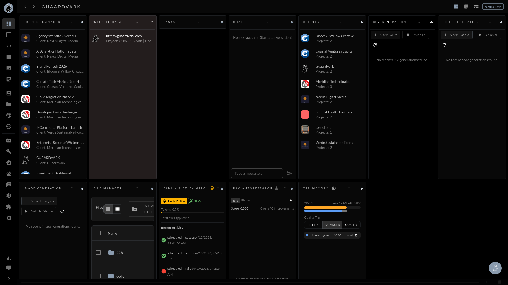 | 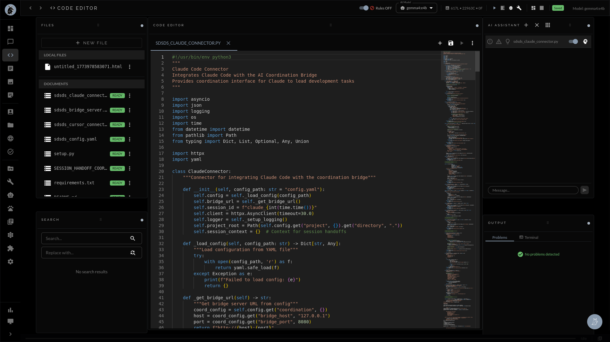 |

| Media Library | Video Generation |
|:-:|:-:|
| 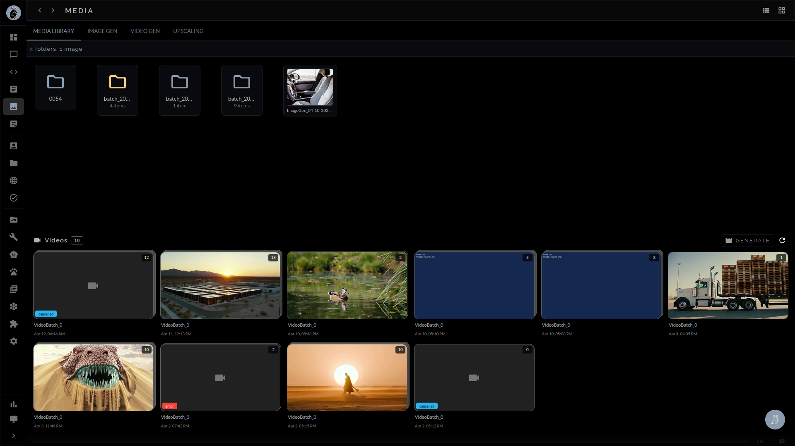 |  |

| Plugins | Swarm Plan Editor |
|:-:|:-:|
|  | 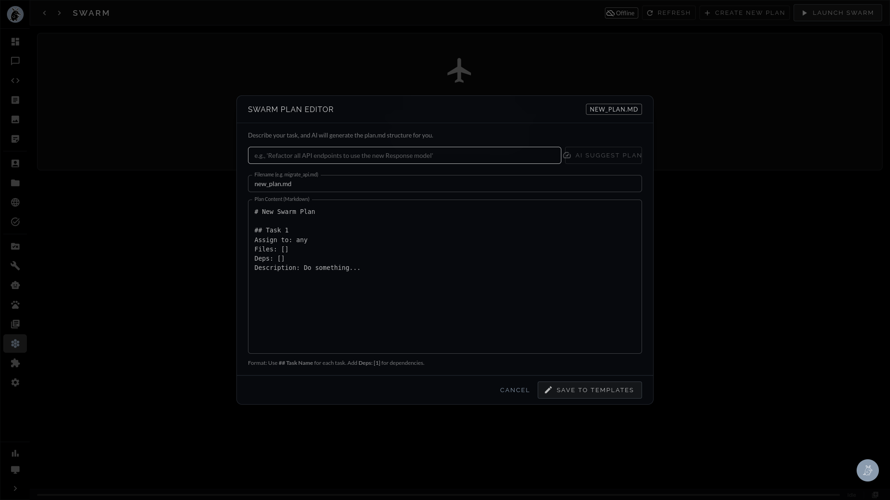 |

| Settings — RAG | Settings — Memory |
|:-:|:-:|
| 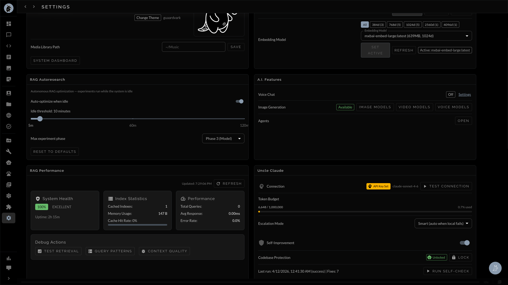 | 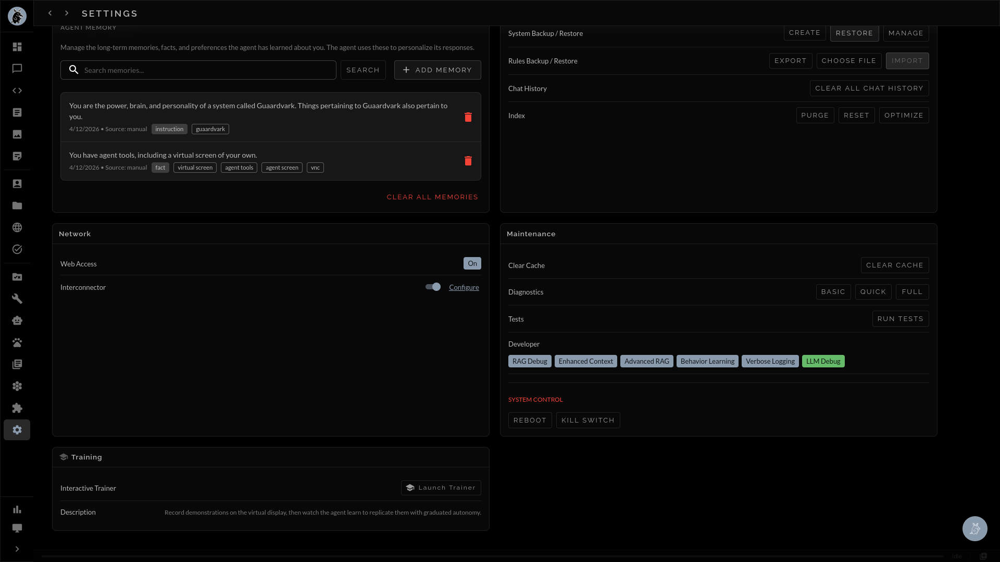 |

---

## Quick Start

```bash
git clone https://github.com/guaardvark/guaardvark.git
cd guaardvark
./start.sh
```

First run handles everything: Python venv, Node dependencies, PostgreSQL, Redis, Ollama, Whisper.cpp, database migrations, frontend build, and all services. Requires your system password once for PostgreSQL setup.

| Service | URL |
|---------|-----|
| Web UI | http://localhost:5173 |
| API | http://localhost:5000 |
| Health Check | http://localhost:5000/api/health |

```bash
./start.sh                    # Full startup with health checks
./start.sh --fast             # Skip dependency checks
./start.sh --test             # Health diagnostics
./start.sh --plugins          # Start all enabled plugins
./stop.sh                     # Stop all services
```

### Install via PyPI

```bash
pip install guaardvark
```

The CLI connects to a running Guaardvark instance or launches a lightweight embedded server automatically.

---

## CLI

41 commands with tab completion and fuzzy matching. Install from PyPI or use the built-in REPL.

```bash
guaardvark                              # Interactive REPL
guaardvark status                       # System dashboard
guaardvark chat "explain this codebase" # Chat with RAG context
guaardvark search "query"               # Semantic search
guaardvark files upload report.pdf      # Upload and index
```

### REPL Slash Commands

```
/imagine <prompt>       Generate an image from text
/video <prompt>         Generate a video from text
/voice <text>           Text-to-speech output
/agent                  Toggle autonomous agent mode
/web                    Open the web UI
/ingest <path>          Index files or directories for RAG
/search <query>         Semantic search over indexed documents
/models list            List available Ollama models
/remember <text>        Save to persistent memory
/memory list|search     Browse saved memories
/backup create          Create a system backup
/jobs list|watch        Monitor background tasks
/config                 View or change settings
/help                   Full command reference
```

---

## Requirements

| Dependency | Version | Notes |
|-----------|---------|-------|
| Python | 3.12+ | Backend |
| Node.js | 20+ | Frontend build |
| PostgreSQL | 14+ | Auto-installed |
| Redis | 5.0+ | Auto-installed |
| Ollama | latest | Local LLM inference |
| CUDA GPU | 8GB+ VRAM | 16GB recommended for video generation |

### GPU Memory Guide

| Feature | Minimum | Recommended |
|---------|---------|-------------|
| Chat + RAG | 4GB | 8GB |
| Image generation | 6GB | 12GB |
| Wan 2.2 video | 11GB | 16GB |
| CogVideoX-5B video | 16GB | 20GB |
| Upscaling | 0.5GB | 2–4GB |

---

## Architecture

```
Browser / CLI (PyPI: guaardvark)
    | HTTP + WebSocket
    v
Flask (68 REST blueprints + GraphQL + Socket.IO)
    |
    +-- AgentBrain (3-tier routing: Reflex → Instinct → Deliberation)
    |
Service Layer (48 modules)
|-- Agent Executor (ReACT loop + 57 tools + BrainState)
|-- RAG Pipeline (LlamaIndex + hybrid retrieval)
|-- Self-Improvement Engine (detect → fix → verify → broadcast)
|-- Generation Services (image, video, voice, content)
|-- Swarm Orchestrator (parallel agents + git worktree isolation)
|-- Servo Controller (closed-loop vision targeting + calibration)
|-- Vision Pipeline (frame analysis + camera capture)
\-- Interconnector (multi-machine sync)
    |
+---+---+---+---+
v   v   v   v   v
PostgreSQL  Redis  Ollama  Virtual Display  ComfyUI
            Celery         (Xvfb :99)
```

**Frontend:** React 18 · Vite · Material-UI v5 · Zustand · Apollo Client · Monaco Editor · Socket.IO  
**Models:** Gemma4 · Qwen3-VL · Qwen3 · Llama 3 · Moondream · Stable Diffusion · Wan 2.2 · CogVideoX · Real-ESRGAN · HAT

---

## Support the Project

Guaardvark is built with love by a solo developer. If it's useful to you:

- [Ko-fi](https://ko-fi.com/albenze) (zero fees!)
- [GitHub Sponsors](https://github.com/sponsors/guaardvark)
- [PayPal](https://paypal.me/albenze)

Star the repo if you find it interesting — it helps with visibility.

---

## Contributing

We welcome contributions! See the [Contributing Guide](CONTRIBUTING.md) to get started.

Looking for something to work on? Check out issues labeled [`good first issue`](https://github.com/guaardvark/guaardvark/issues?q=is%3Aissue+is%3Aopen+label%3A%22good+first+issue%22).

---

## License

[MIT License](LICENSE) — Copyright (c) 2025-2026 Albenze, Inc.

<p align="center">
  
</p>
