# Guaardvark

**Version 2.5.2** · [guaardvark.com](https://guaardvark.com)

The self-hosted AI workstation. Autonomous agents that see your screen and control your apps. A three-tier neural routing engine. Parallel agent swarms across isolated git worktrees. Video generation, image upscaling to 4K/8K, RAG over your documents, voice interface, and a 57-tool execution engine — all running locally on your hardware. Your machine. Your data. Your rules.

<p align="center">
  
</p>

[](LICENSE)
[](https://github.com/guaardvark/guaardvark/actions/workflows/ci.yml)
[](https://pypi.org/project/guaardvark/)
[](https://github.com/guaardvark/guaardvark/stargazers)
[](https://github.com/guaardvark/guaardvark/issues)
[](https://github.com/sponsors/guaardvark)

```bash
git clone https://github.com/guaardvark/guaardvark.git && cd guaardvark && ./start.sh
```

One command. Installs everything. Starts all services. Done.

### AI-Generated Film — Made Entirely with Guaardvark

Every frame generated on a single desktop GPU. No cloud. No stock footage. No API keys.

[](https://www.youtube.com/watch?v=8MdtM3HurJo)

---

## What Makes This Different

### AgentBrain — Three-Tier Neural Routing

Every message is routed through a three-tier decision engine that picks the fastest path to the right answer. Reflexes fire in under a millisecond. Instinct handles single-shot requests in one LLM call. Deliberation spins up a full ReACT reasoning loop when the problem demands it.

| Agent Control | Agent Tools |
|:-:|:-:|
| 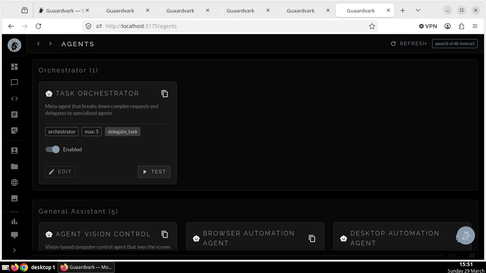 | 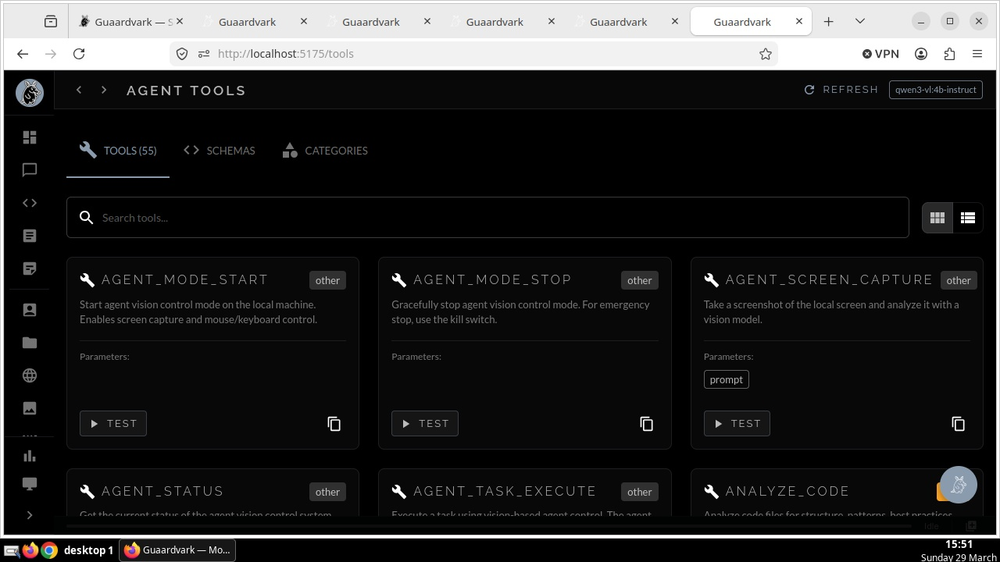 |

| Tier | Name | Latency | LLM Calls | When It Fires |
|------|------|---------|-----------|---------------|
| 1 | **Reflex** | <100ms | 0 | Greetings, farewells, media controls — pattern-matched, no inference |
| 2 | **Instinct** | 1–3s | 1 | Single-shot questions, web searches, image generation, vision tasks |
| 3 | **Deliberation** | 5–30s | 3–10 | Multi-step research, analysis chains, complex agent tasks |

- **Automatic escalation** — Tier 2 can signal complexity and hand off to Tier 3 mid-response
- **BrainState singleton** — pre-computes tool schemas, model capabilities, system prompts, and reflex tables at startup so routing adds zero overhead
- **Warm-up** — background thread loads the active model into VRAM before the first request arrives

### Autonomous Screen Agents

Guaardvark agents control a real virtual desktop (Xvfb + openbox at 1280x720). They see the screen through vision models, move the mouse, click buttons, type text, navigate browsers, and verify their own actions.

- **Unified vision brain** — Gemma4 sees the screen and decides the next action in a single inference call. Qwen3-VL handles coordinate estimation. Both calibrated per-model with tracked scale factors.
- **Closed-loop servo targeting** — three-attempt adaptive strategy: ballistic move → single correction with crosshair overlay → full corrections with zoom-cropped analysis around the cursor
- **45+ deterministic recipes** — browser navigation, tabs, scroll, search, find, zoom, copy/paste — all execute instantly from a JSON recipe library, bypassing the vision loop entirely
- **Obstacle detection** — handles popups, permission dialogs, and notification bars with automatic thinking model escalation
- **Self-QA sweep** — agent navigates every page of its own UI and reports what's working and what's broken
- **Live agent monitor** — real-time SEE/THINK/ACT transcript of every decision the agent makes
- **Integrated screen viewer** — draggable, resizable VNC viewer on any page with popup window mode

#### Supported Vision Models

| Model | Role | Coordinate System | Notes |
|-------|------|-------------------|-------|
| Gemma4 (e4b) | Sees + decides | 1024x1024 normalized, box_2d `[y1,x1,y2,x2]` | Unified brain — vision and reasoning in one call |
| Qwen3-VL (2b) | Coordinate estimation | 1024px internal width | Default servo eyes, fast and accurate on dark UIs |
| Qwen3-VL (4b/8b) | Escalation eyes | 1024px internal width | Automatic escalation after 3 consecutive failures |
| Moondream | Fallback eyes | 1024px internal width | For text-only models that need external vision |

### Swarm Orchestrator — Parallel Agent Execution

Launch multiple AI coding agents in parallel, each working in an isolated git worktree on its own branch. Results merge back with dependency-ordered conflict detection, optional test validation, and full cost tracking.

- **Two backends** — Claude Code (cloud, cost-tracked at $0.015/$0.075 per 1K tokens) and Cline/OpenClaw (fully local via Ollama, zero cost)
- **Flight Mode** — fully offline operation. Auto-detects network state, falls back to local models, serializes file conflicts automatically. No prompts, no internet required.
- **Git worktree isolation** — each task gets its own branch and working directory. All worktrees share the `.git` directory (lightweight). Automatically excluded from `git status`.
- **Dependency-aware merging** — topological sort ensures foundational changes land first. Dry-run conflict detection before real merge. Test suite validation before integration.
- **Built-in templates** — REST API scaffold, refactor-and-extract, test coverage expansion, Flight Mode demo
- **Up to 20 concurrent agents** — configurable limit with automatic slot management
- **Live dashboard** — real-time status, per-task logs, cost breakdown, elapsed time, disk usage

### Video Generation Pipeline

State-of-the-art video generation running entirely on your GPU. No cloud APIs, no per-minute billing, no content restrictions.

| Video Generation | Plugin System |
|:-:|:-:|
| 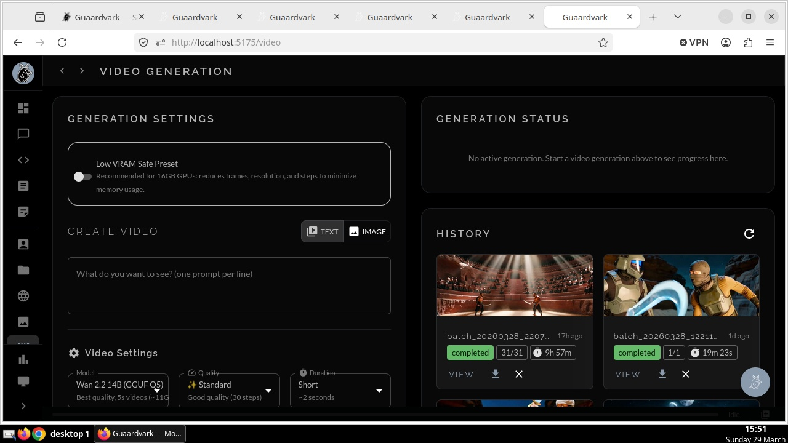 | 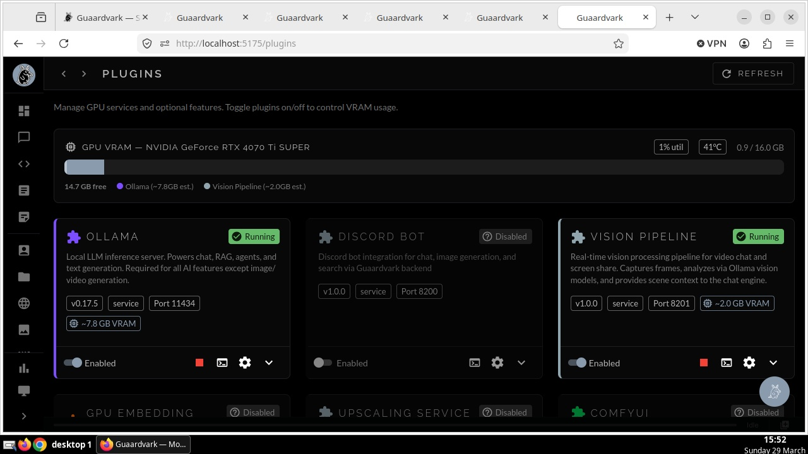 |

| Model | Type | Max Duration | Native Resolution | VRAM |
|-------|------|-------------|-------------------|------|
| **Wan 2.2 (14B MoE)** | Text-to-Video | 5s (81 frames @ 16fps) | 832x480 | 11GB |
| **CogVideoX-5B** | Text-to-Video | 6s (49 frames @ 8fps) | 720x480 | 16GB |
| **CogVideoX-2B** | Text-to-Video | 6s (49 frames @ 8fps) | 720x480 | 12GB |
| **CogVideoX-5B I2V** | Image-to-Video | 6s (49 frames @ 8fps) | 720x480 | 16GB |
| **SVD XT** | Text-to-Video | 3.5s (25 frames @ 7fps) | 512x512 | <8GB |

- **Resolution options** — 512px, 576px, 720px, 1280px, 1920px (1080p), and custom dimensions (multiples of 8)
- **Quality tiers** — Fast (10 steps), Standard (30), High (40), Maximum (50)
- **Frame interpolation** — 1x raw, 2x doubled FPS, 2x + upscale for cinema-quality output
- **Prompt enhancement** — Cinematic, Realistic, Artistic, Anime, or raw
- **Low VRAM mode** — automatically reduces resolution, frames, and inference steps for 8–12GB GPUs
- **Batch processing** — queue multiple videos from a prompt list, processed by Celery workers
- **ComfyUI integration** — one-click launch to the node editor for custom workflows

### GPU Image Upscaling — 4K and 8K Output

Upscale images and video frames to 4K (3840px) or 8K (7680px) resolution using GPU-accelerated super-resolution models.

| Model | Scale | Size | Best For |
|-------|-------|------|----------|
| HAT-L SRx4 | 4x | 159 MB | Maximum quality restoration |
| RealESRGAN x4plus | 4x | 64 MB | General-purpose, photorealistic |
| RealESRGAN x2plus | 2x | 64 MB | Mild upscaling |
| RealESRGAN x4plus (Anime) | 4x | 17 MB | Anime and stylized content |
| realesr-animevideov3 | 4x | 6 MB | Video-optimized anime |
| 4x-UltraSharp | 4x | 67 MB | Enhanced sharpness |
| 4x NMKD-Superscale | 4x | 67 MB | Advanced super-scaling |
| 4x Foolhardy Remacri | 4x | 67 MB | Texture-focused upscaling |

- **Two-pass mode** — run the model twice for maximum quality
- **Precision control** — FP16 (standard GPUs), BF16 (Ampere+), torch.compile for up to 3x speedup
- **Video upscaling** — frame-by-frame processing with progress tracking for MP4, MKV, AVI, MOV, WebM
- **Watch folder** — optional auto-processing of new files dropped into a directory

### RAG That Actually Works

Chat grounded in your documents. Upload files, build a knowledge base, and ask questions. The AI reads and understands your content — not just keyword matching.

| Chat with RAG | Document Manager |
|:-:|:-:|
| 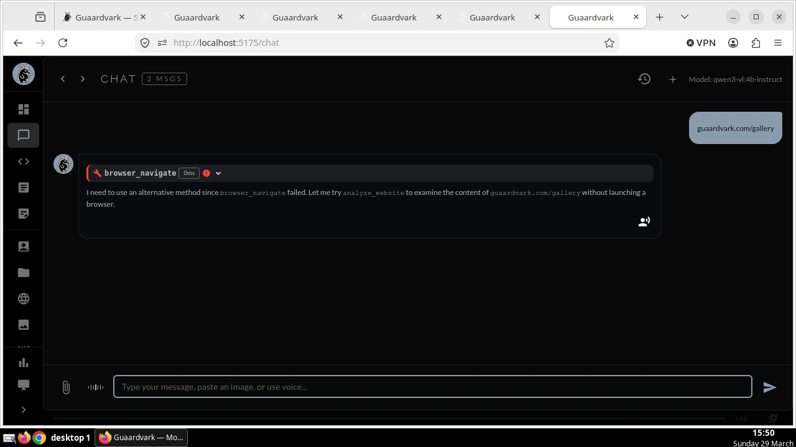 | 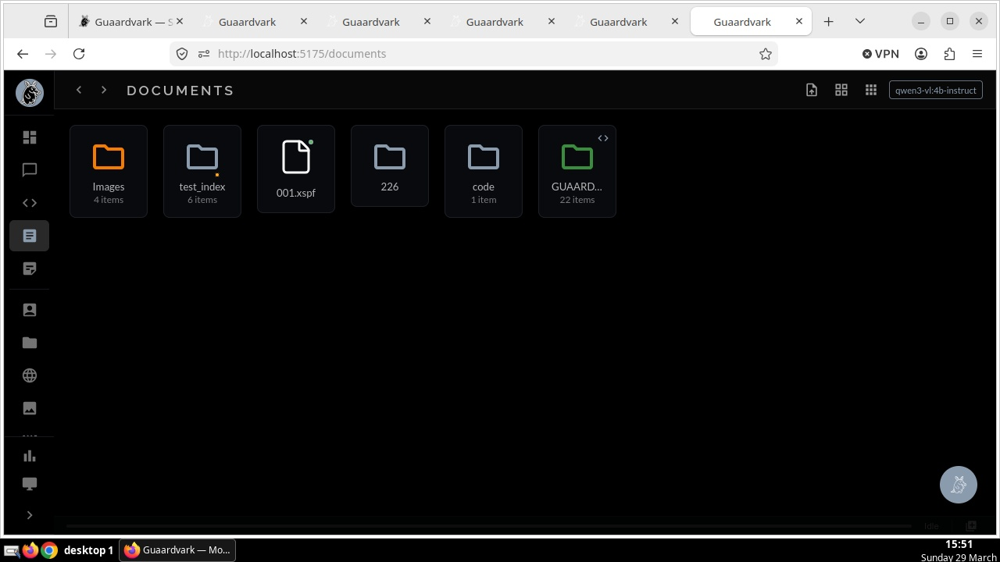 |

- **Hybrid retrieval** — BM25 keyword + vector semantic search combined
- **Smart chunking** — code files get AST-informed chunking, prose gets semantic splitting
- **Multiple embedding models** — switch between lightweight (300M) and high-quality (4B+) via UI
- **RAG Autoresearch** — autonomous optimization loop that experiments with parameters, keeps improvements, reverts regressions
- **Entity extraction** — automatic entity and relationship indexing
- **Per-project isolation** — each project has its own knowledge base and chat context

### Self-Improving AI

The system runs its own test suite, identifies failures, dispatches an AI agent to read the code and fix the bugs, verifies the fix, and broadcasts the learning to other instances. No human in the loop.

- **Three modes** — Scheduled (every 6 hours), Reactive (triggered by repeated 500 errors), Directed (manual tasks)
- **Guardian review** — Uncle Claude (Anthropic API) reviews code changes for safety before applying, with risk levels and halt directives
- **Verification loop** — re-runs tests after every fix to confirm it worked
- **Pending fixes queue** — stage, review, approve, or reject proposed changes
- **Cross-machine learning** — fixes propagate to all connected instances via the Interconnector

---

## Full Feature Set

### AI & Chat
- **57 registered tools** across 12 categories — web search, browser automation, code execution, file management, media control, desktop automation, MCP integration, knowledge base, image generation, agent control
- **9 specialized agents** — code assistant, content creator, research agent, browser automation, vision control, and more
- **ReACT agent loop** — iterative reasoning, action, observation with tool execution guard and circuit breaker
- **Streaming responses** via Socket.IO with conversational fast-path (~700ms)
- **Tool call transparency** — collapsible tool call cards showing parameters, results, timing, and success/error status inline in chat
- Runtime model switching — swap LLMs through the UI, GPU memory managed automatically
- Voice interface — Whisper.cpp STT + Piper TTS with narration and voiceover
- Session history with search, grouping, previews, and persistent tool call data
- **Persistent memory** — save facts, instructions, and context across sessions with automatic LLM injection
- **Uncle Claude escalation** — optional Anthropic API integration for problems that need a bigger model, with monthly token budgeting

### Image Generation
- Stable Diffusion via Diffusers library — batch queue with auto-registration to file system
- Face restoration, anatomy enhancement, and detail controls
- Image library with thumbnail grid, lightbox preview, keyboard navigation, batch operations
- **Bates-numbered output** — generated files auto-registered with timestamped sequential naming

### Agent & Code Tools
- **Monaco code editor** — built-in IDE with AI-powered explain, fix, and generate via right-click context menu
- **Self-demo system** — automated feature tour with screen recording and TTS narration
- **Media viewer** — inline document and media previews with thumbnail strip navigation

### File & Document Management
- Desktop-style UI — draggable folder icons, resizable windows, right-click context menus
- Drag-and-drop upload preserving folder structures
- Folder properties linked to clients, projects, and websites

### Multi-Machine Sync (Interconnector)
- Connect multiple instances into a family that shares code, learnings, and model configs
- Master/client architecture with approval workflows and pre-sync backups

### Plugin System
- **Managed plugins** with health monitoring, port-based orphan cleanup, and auto-restore on restart
- Ollama, ComfyUI, Vision Pipeline, Upscaling, Swarm Orchestrator, and Discord bot
- Live VRAM monitoring with GPU conflict detection
- Model download management from HuggingFace with progress tracking

### Vision Pipeline
- Real-time frame analysis via Ollama vision models with adaptive FPS throttling
- Two-layer change detection — perceptual hash + semantic analysis
- Local camera capture with device enumeration and stream management
- Context buffer with sliding window and compression

### System
- Dashboard with live status cards for model health, GPU, self-improvement, RAG
- Celery background task system with live progress
- Six built-in themes
- Container support with Containerfile for isolated testing
- Comprehensive backup and restore — granular or full, with schema migration support

---

## Screenshots

| Dashboard | Image Generation |
|:-:|:-:|
| 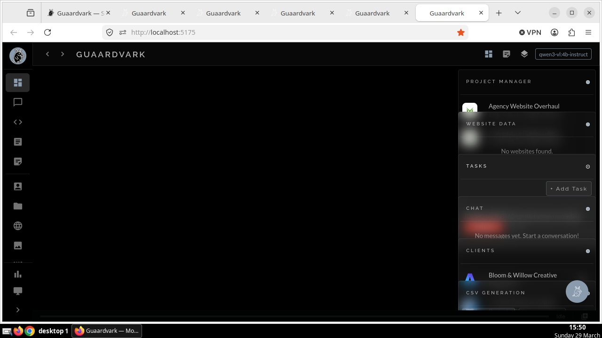 | 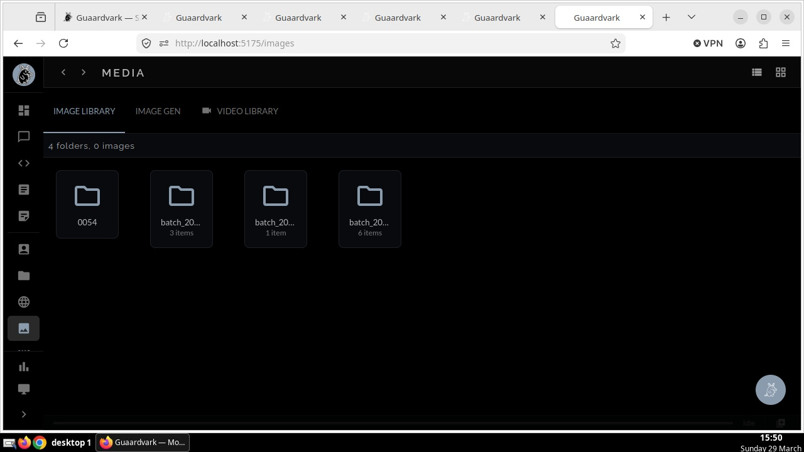 |

| Code Editor | Projects |
|:-:|:-:|
| 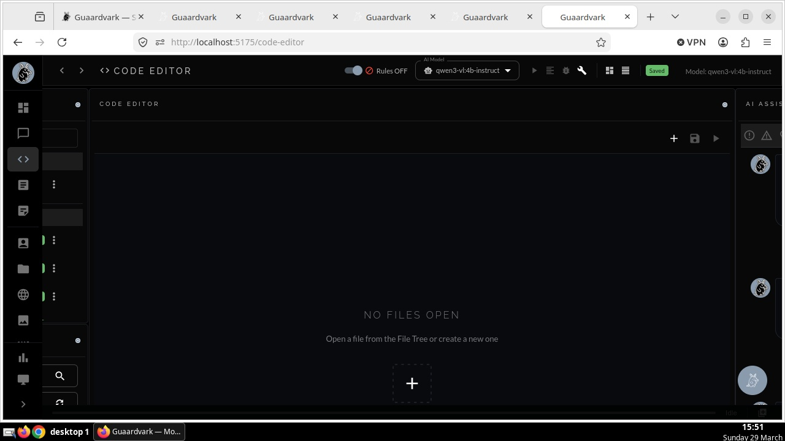 | 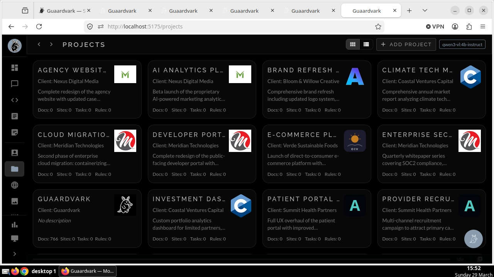 |

| Rules & Prompts | Settings |
|:-:|:-:|
| 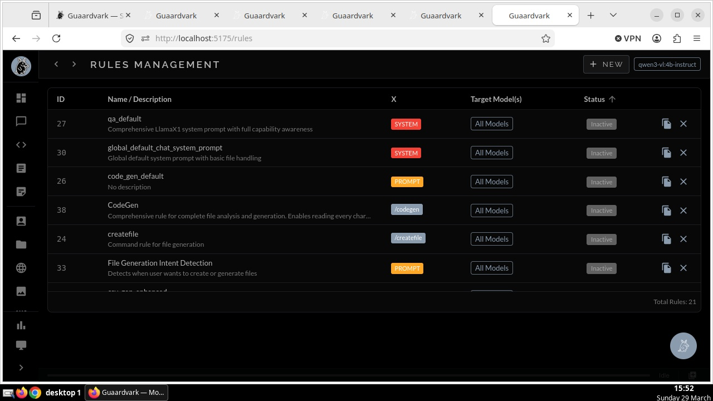 | 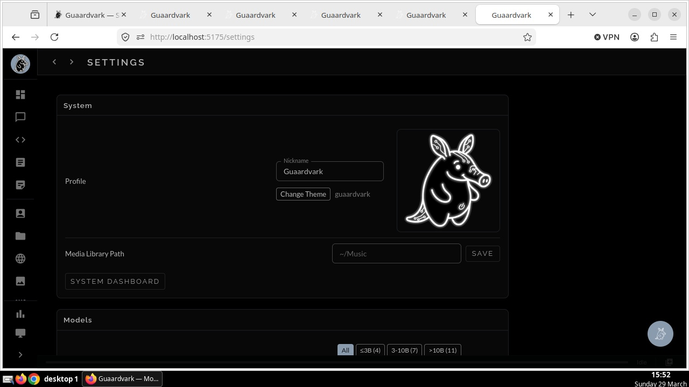 |

| Clients | Notes |
|:-:|:-:|
| 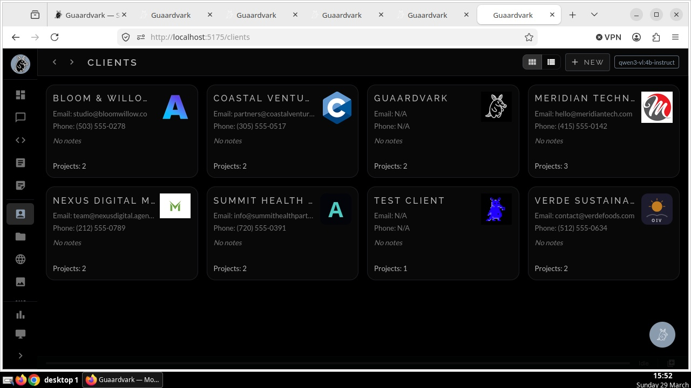 | 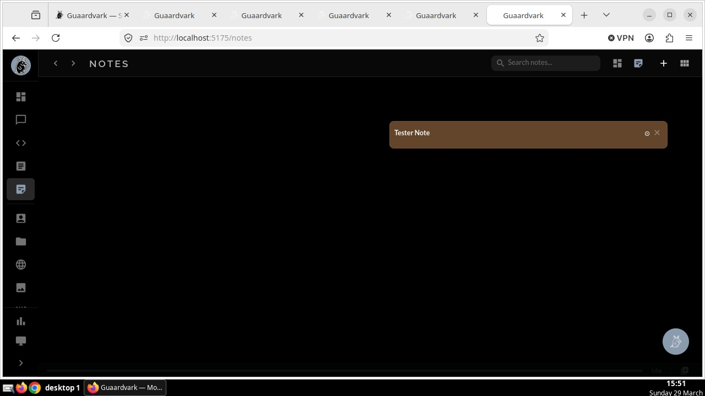 |

---

## Quick Start

```bash
git clone https://github.com/guaardvark/guaardvark.git
cd guaardvark
./start.sh
```

First run handles everything: Python venv, Node dependencies, PostgreSQL, Redis, Ollama, Whisper.cpp, database migrations, frontend build, and all services. Requires your system password once for PostgreSQL setup.

| Service | URL |
|---------|-----|
| Web UI | http://localhost:5173 |
| API | http://localhost:5000 |
| Health Check | http://localhost:5000/api/health |

```bash
./start.sh                    # Full startup with health checks
./start.sh --fast             # Skip dependency checks
./start.sh --test             # Health diagnostics
./start.sh --plugins          # Start all enabled plugins
./stop.sh                     # Stop all services
```

### Install via PyPI

```bash
pip install guaardvark
```

The CLI connects to a running Guaardvark instance or launches a lightweight embedded server automatically.

---

## CLI

41 commands with tab completion and fuzzy matching. Install from PyPI or use the built-in REPL.

```bash
guaardvark                              # Interactive REPL
guaardvark status                       # System dashboard
guaardvark chat "explain this codebase" # Chat with RAG context
guaardvark search "query"               # Semantic search
guaardvark files upload report.pdf      # Upload and index
```

### REPL Slash Commands

```
/imagine <prompt>       Generate an image from text
/video <prompt>         Generate a video from text
/voice <text>           Text-to-speech output
/agent                  Toggle autonomous agent mode
/web                    Open the web UI
/ingest <path>          Index files or directories for RAG
/search <query>         Semantic search over indexed documents
/models list            List available Ollama models
/remember <text>        Save to persistent memory
/memory list|search     Browse saved memories
/backup create          Create a system backup
/jobs list|watch        Monitor background tasks
/config                 View or change settings
/help                   Full command reference
```

---

## Requirements

| Dependency | Version | Notes |
|-----------|---------|-------|
| Python | 3.12+ | Backend |
| Node.js | 20+ | Frontend build |
| PostgreSQL | 14+ | Auto-installed |
| Redis | 5.0+ | Auto-installed |
| Ollama | latest | Local LLM inference |
| CUDA GPU | 8GB+ VRAM | 16GB recommended for video generation |

### GPU Memory Guide

| Feature | Minimum | Recommended |
|---------|---------|-------------|
| Chat + RAG | 4GB | 8GB |
| Image generation | 6GB | 12GB |
| Wan 2.2 video | 11GB | 16GB |
| CogVideoX-5B video | 16GB | 20GB |
| Upscaling | 0.5GB | 2–4GB |

---

## Architecture

```
Browser / CLI (PyPI: guaardvark)
    | HTTP + WebSocket
    v
Flask (68 REST blueprints + GraphQL + Socket.IO)
    |
    +-- AgentBrain (3-tier routing: Reflex → Instinct → Deliberation)
    |
Service Layer (48 modules)
|-- Agent Executor (ReACT loop + 57 tools + BrainState)
|-- RAG Pipeline (LlamaIndex + hybrid retrieval)
|-- Self-Improvement Engine (detect → fix → verify → broadcast)
|-- Generation Services (image, video, voice, content)
|-- Swarm Orchestrator (parallel agents + git worktree isolation)
|-- Servo Controller (closed-loop vision targeting + calibration)
|-- Vision Pipeline (frame analysis + camera capture)
\-- Interconnector (multi-machine sync)
    |
+---+---+---+---+
v   v   v   v   v
PostgreSQL  Redis  Ollama  Virtual Display  ComfyUI
            Celery         (Xvfb :99)
```

**Frontend:** React 18 · Vite · Material-UI v5 · Zustand · Apollo Client · Monaco Editor · Socket.IO  
**Models:** Gemma4 · Qwen3-VL · Qwen3 · Llama 3 · Moondream · Stable Diffusion · Wan 2.2 · CogVideoX · Real-ESRGAN · HAT

---

## Support the Project

Guaardvark is built with love by a solo developer. If it's useful to you:

- [Ko-fi](https://ko-fi.com/albenze) (zero fees!)
- [GitHub Sponsors](https://github.com/sponsors/guaardvark)
- [PayPal](https://paypal.me/albenze)

Star the repo if you find it interesting — it helps with visibility.

---

## Contributing

We welcome contributions! See the [Contributing Guide](CONTRIBUTING.md) to get started.

Looking for something to work on? Check out issues labeled [`good first issue`](https://github.com/guaardvark/guaardvark/issues?q=is%3Aissue+is%3Aopen+label%3A%22good+first+issue%22).

---

## License

[MIT License](LICENSE) — Copyright (c) 2025-2026 Albenze, Inc.
