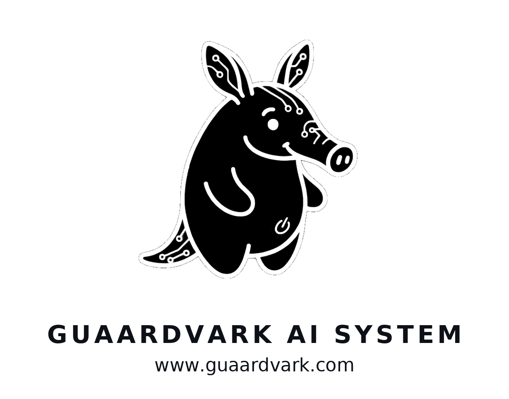

<p align="center">
  <picture>
    <source media="(prefers-color-scheme: dark)" srcset="docs/media/guaardvark-banner-dark.png">
    
  </picture>
</p>

<!-- hero-video rotation: swap the bare user-attachments URL below.
     Asset registry: https://github.com/guaardvark/guaardvark/issues/64
     batman:    c6d9d18b-cfff-4ae2-8220-dc7f329fee5d
     bladevark: 158c431c-0ff8-4b25-a1b2-b5fbebdc81d4
     batvark:   b8f28582-6c1d-45b8-862e-9206a28cf103 -->

<div align="center">

# Guaardvark

**The self-hosted AI studio.** Chat with your own files, hand tasks to agents that use a real desktop and browser, run parallel coding agents, and generate video, images, music and voice. Everything runs locally, on your own GPU.

[](LICENSE)
[](https://github.com/guaardvark/guaardvark/actions/workflows/ci.yml)
[](https://pypi.org/project/guaardvark/)
[](https://glama.ai/mcp/servers/guaardvark/guaardvark)
[](https://github.com/guaardvark/guaardvark/stargazers)
[](https://github.com/sponsors/guaardvark)

[Quick start](#quick-start) · [Features](#features) · [Videos](#watch-it-work) · [FAQ](#faq) · [Full capability list](CAPABILITIES.md) · [guaardvark.com](https://guaardvark.com)

https://github.com/user-attachments/assets/c6d9d18b-cfff-4ae2-8220-dc7f329fee5d

</div>

## Why Guaardvark

- **It runs on your machine.** Language models, retrieval, agents and every generator run on your own hardware, through Ollama, ComfyUI and Guaardvark's own GPU services. No cloud API keys, no per-token or per-minute fees, nothing reported home. Web access, posting and every other outbound path stay off until you switch them on or start them, and all of them are declared in one file, [`egress.json`](scripts/inbound_guard/egress.json).
- **One install is the whole studio.** Chat and RAG, screen agents, coding swarms and a full media pipeline share one GPU through a single orchestrator, so a video render and a language model take turns instead of fighting over VRAM.
- **Your coding agent can drive it.** A built-in MCP server, fifteen [agent skills](.agents/skills/README.md) and a Claude Code plugin let Claude Code, Cursor, Codex, Gemini CLI and other agents run every flow: "make a music video from this song", "film this script", "train a LoRA of this character", "swarm this refactor".
- **You approve what matters.** Nothing posts and no voice is cloned without an explicit yes from you, and fixes Guaardvark writes for its own code wait for your review. The MCP server hides desktop, shell and browser tools unless you allowlist them.

## Quick start

**Linux with an NVIDIA GPU** (16 GB for video, 12 GB for the Wan 2.2 5B; chat, RAG and agents run on less, see the [hardware tiers](docs/HARDWARE.md)). A fresh Ubuntu desktop has no `curl` or `git`; run `sudo apt install -y curl git` first.

```bash
curl -fsSL https://guaardvark.com/install.sh | bash
```

Then open **http://localhost:5173**. The script is [install.sh](install.sh) from this repository: it clones to `~/guaardvark` and runs `./start.sh`, which installs everything on the first run. To read it before it runs, download it first (`curl -fsSL https://guaardvark.com/install.sh -o install.sh`, read it, then `bash install.sh`), or [install by hand](#install-by-hand).

**Add it to Claude Code** (two lines, no clone):

```
/plugin marketplace add guaardvark/guaardvark
/plugin install guaardvark@guaardvark
```

Other ways in: [Docker](INSTALL.md#alternative-docker-linux-core-stack-only) · [macOS on Apple Silicon](INSTALL.md#install-macos-apple-silicon) · [the CLI from PyPI](#cli) · [the full install guide](INSTALL.md). The current release is in the [VERSION](VERSION) file.

## Features

- **Chat with your own files.** Local RAG on pgvector: keyword and vector search fused per query, cross-encoder reranking, source citations, and retrieval that shows the chunks and scores behind an answer. Autoresearch tunes retrieval overnight. [▶ Ep 3](https://www.youtube.com/watch?v=pT_J93qTCL0)
- **Agents on a real desktop.** Screen agents get an Ubuntu desktop of their own, see it with a vision model, click with closed-loop targeting, and work in a real browser while you watch from any page. [▶ Ep 4](https://www.youtube.com/watch?v=3VfHrJmqYos)
- **Parallel coding agents.** A swarm of coding agents, each in its own git worktree, merged back in dependency order. Runs on Claude Code or fully locally through Ollama.
- **MCP, both ways.** An MCP server that plugs into Claude Code, Cursor, Codex, Gemini CLI, Zed and more with one command, and an MCP client so chat can use tools from other servers. [▶ Ep 21](https://www.youtube.com/watch?v=VScsEFn6ZoY) · [▶ Ep 16](https://www.youtube.com/watch?v=1qc6GZBLy5k)
- **Video generation.** 13 local video models across five families (Wan 2.2, LTX, HunyuanVideo, CogVideoX, and MiniMax H3 with its own soundtrack), video LoRAs, a batch queue, frame interpolation, and one click into ComfyUI. [▶ Ep 6](https://www.youtube.com/watch?v=9rae9IJhXow)
- **LoRA training and consistent characters.** Train character, environment and prop LoRAs from a few reference photos on your own GPU, import LoRAs trained elsewhere, and keep the same character across images, video, music videos and Film Crew productions. [Details](#lora-training-and-consistent-characters)
- **Images.** Z-Image, FLUX.1, Krea 2, SDXL and Sana Sprint (1024 stills in seconds, even on 8 GB cards) generation, photo edits by instruction, inpainting and outpainting, and 4K/8K upscaling. [▶ Ep 5](https://www.youtube.com/watch?v=s9I_0gD9Iko)
- **Music and voice.** Full songs with vocals, sound effects, three neural text-to-speech engines, consent-gated voice cloning, and hands-free voice chat. [▶ Ep 7](https://www.youtube.com/watch?v=BXlm7p-SxtU)
- **Directors.** A beat-synced music-video director, a five-role Film Crew that turns a logline into a finished video, and a built-in video editor. [▶ Ep 8](https://www.youtube.com/watch?v=l2LqKA9GQDc) · [▶ Ep 9](https://www.youtube.com/watch?v=sq104u9N4Qg)
- **Self-improvement.** Guaardvark tests itself, drafts fixes and stages them for your review behind a codebase lock; the System Map draws the whole codebase from its real imports. [▶ Ep 11](https://www.youtube.com/watch?v=7kHvi_2vT6U) · [▶ Ep 14](https://www.youtube.com/watch?v=yEy1tVKxsF0)
- **Command center.** A GPU orchestrator, a plugin manager with a live VRAM budget, jobs and scheduling, schema-aware backups, and a multi-machine Interconnector. [▶ Ep 12](https://www.youtube.com/watch?v=A1-_ykcHOhQ)
- **Terminal and API.** The `guaardvark` [CLI](#cli) with an interactive REPL, plus REST, GraphQL and Socket.IO. [▶ Ep 20](https://www.youtube.com/watch?v=Z3nXVtfdlSI)

The complete, enumerated list of models, tools, plugins and pages is in **[CAPABILITIES.md](CAPABILITIES.md)**.

---

## Chat with your own files (local RAG)

Upload documents, build a knowledge base per project, and ask questions. Answers are grounded in your files and cite where they came from.

- **Hybrid retrieval.** Postgres full-text keyword search and vector search, fused with a per-query weighting that leans toward keywords for identifier-like queries and toward meaning for prose.
- **Cross-encoder reranking.** A reranker (one Install in Settings) reads the query and passage together and reorders the candidates. It is admitted against free VRAM and falls back to CPU rather than competing with image or video generation.
- **Layout-aware parsing.** PDF, DOCX and PPTX are parsed for reading order and section headers, and PDF passages carry the page they came from. (Scanned documents need OCR, which is not installed by default; they say so rather than indexing as empty.)
- **Grounded citations.** Every chunk carries its source file and section breadcrumb (and, for PDFs, the page), written into the embedded text as well, so a passage lifted from the middle of a document still says where it came from.
- **Smart chunking.** Code gets AST-informed chunks, so a function stays one chunk; prose gets semantic splitting.
- **Postgres-backed vector store.** Embeddings live in pgvector next to the rest of your data, with an ANN index and a persisted full-text index, covered by the same backups.
- **Retrieval that shows its work.** Live retrieval tests show the actual chunks and scores behind an answer ([Episode 3](https://www.youtube.com/watch?v=pT_J93qTCL0)), and every query can return a trace of which retrieval legs ran, so a degraded answer can be told apart from a bad one.
- **More:** index profiles (the same documents projected more than one way), corpus-level summaries for "what are the themes across all of this", a choice of embedding models from 300M to 4B+, entity extraction, and per-project isolation.

**Autoresearch tunes retrieval while you sleep.** An overnight loop proposes changes to chunking and retrieval settings, scores them with an LLM-as-judge harness, keeps the wins and reverts the regressions, bounded by a wall-clock budget, a run ledger and a circuit breaker. The morning report says what changed and why.

**One chat box, three speeds.** Every message goes through a three-tier router that picks the fastest path to the right answer ([Episode 2](https://www.youtube.com/watch?v=5HcSAf96j_M)):

| Tier | Name | Latency | LLM calls | When it fires |
|------|------|---------|-----------|---------------|
| 1 | **Reflex** | <100 ms | 0 | Deterministic actions such as media controls, pattern-matched with no inference |
| 2 | **Instinct** | 1–3 s | 1 | Conversation and most requests: single questions, web searches, image generation, vision |
| 3 | **Deliberation** | 5–30 s | 3–10 | Multi-step research, analysis chains, complex agent tasks (a full ReACT loop) |

Desktop and vision tools are only offered to the model while the agent screen is active.

## Agents that use a real desktop and browser

Guaardvark's agents control a **real Ubuntu desktop** (Xvfb and XFCE on display `:99`): the same Applications menu, desktop icons and taskbar you would see if you connected to the box over VNC. They see the screen through a vision model, move the mouse, click, type, browse, and check their own work. The desktop is isolated from yours: its own `XDG_DESKTOP_DIR` and `XDG_CONFIG_HOME`, so the agent's files and settings never collide with your session.

- **One vision brain.** Gemma4 sees the screen, decides the next action and returns click coordinates in a single inference call.
- **Closed-loop targeting.** The servo moves, checks where the cursor actually landed, and corrects until it is on the target, rejecting targets the model cannot really see.
- **Live reasoning.** Every step (action, target, reasoning, pivots when the loop is stuck) streams into chat as it happens and stays in history, so any run can be audited.
- **Deterministic recipes.** Common browser actions (navigation, tabs, back and forward, find, zoom, bookmarks, YouTube search) run instantly from a recipe library instead of the vision loop, and every recipe is checked against safety bounds before it loads.
- **Done means done.** The agent claims a task is finished only when it can show proof on the screen.
- **Watch it work.** A draggable, resizable viewer of the agent's desktop on any page, with a pop-out window.

<details>
<summary>Vision models and obstacle handling</summary>

| Model | Role | Coordinate system | Notes |
|-------|------|-------------------|-------|
| Gemma4 (e4b) | Sees, decides and clicks | `box_2d` normalized to 1000, `[y1,x1,y2,x2]` | Vision, reasoning and coordinates in one call |
| Moondream | Fallback eyes | 1024 px internal width | For text-only chat models that need external vision |

- **Obstacle detection** checks every step for popups, permission dialogs and notification bars before acting.
- A separate Playwright browser tool handles headless page tasks that don't need a visible screen.
- The screen agent is Linux-only; on macOS the agent tools say so and the rest of the app is unaffected.

</details>

## Parallel coding agents (Swarm)

Launch several coding agents at once, each in an isolated git worktree on its own branch. Results merge back with dependency-ordered conflict detection, optional test validation, and a live dashboard.

- **Backends:** Claude Code, or Cline/OpenClaw running fully locally on an Ollama model.
- **Flight Mode** keeps a swarm offline: tasks run on the local backend only.
- **Git worktree isolation:** every task gets its own branch and working directory, sharing one `.git` directory.
- **Dependency-aware merging:** a topological sort lands foundational changes first, with a dry-run conflict check before the real merge and tests before integration.
- **Templates** for a REST API scaffold, refactor-and-extract, test-coverage expansion, and more.
- **Live dashboard:** status, per-task logs, cost, elapsed time and disk use. Five agents run at once by default; the dashboard takes up to 20.

Film Crew runs on the same orchestrator (see [Directors](#directors-film-crew-music-videos-and-the-editor)).

## MCP server, agent skills and the Claude Code plugin

Guaardvark speaks the Model Context Protocol both ways: it exposes its tools to any MCP client, and it can call tools on other MCP servers. [Episode 21](https://www.youtube.com/watch?v=VScsEFn6ZoY) shows five coding agents (opencode on a local model, Codex, Cursor, Grok and Antigravity) making pictures, clips, songs and voices through it.

- **One-command setup.** `python -m backend.mcp install` finds the agent clients on your machine (Claude Code, Codex, Cursor, Grok, Antigravity, opencode, Claude Desktop, Zed, Gemini CLI) and writes the `guaardvark` server entry into their configs, backing up existing files and leaving other entries alone. `python -m backend.mcp doctor` diagnoses a broken setup with a server self-test, a real stdio handshake, and a scan for stale client configs.
- **Claude Code plugin.** `/plugin marketplace add guaardvark/guaardvark`, then `/plugin install guaardvark@guaardvark`. It asks for the path of your Guaardvark checkout, starts the MCP server from there, and loads every skill as `/guaardvark:<skill>`.
- **Agent skills.** [`.agents/skills/`](.agents/skills/README.md) has one skill per flow (images, video, music video, Film Crew, voice, music, upscaling, Cast and LoRA training, Hugging Face model onboarding, swarm, knowledge, code, outreach, operations, setup) in the [Agent Skills](https://agentskills.io) format, so Claude Code, Cursor, Codex and OpenClaw know which tool to call for each job. `python -m backend.mcp install --skills` links them into `~/.claude/skills`.
- **As a server:** `python -m backend.mcp` (stdio) or `python -m backend.mcp http` (streamable HTTP on `127.0.0.1:8788/mcp`, loopback-only by default). `python -m backend.mcp list-tools` prints the live tool list. Generation tools queue by default and return a batch id for `get_generation_status`; every call runs under an enforced timeout.
- **Default-deny policy** ([`backend/mcp/config.py`](backend/mcp/config.py)): desktop control, agent control, system and shell, browser automation, test execution and MCP meta-tools are hidden unless you allowlist them, and so are tools that need approval. More than 50 tools are exposed by default (RAG, files, generation, memory, code search, web), plus read-only `guaardvark://outputs/` resources.
- **As a client:** `mcp_connect` and `mcp_execute`, with a live inventory so the chat model can find and use tools from other MCP servers by name. Audit logging, timeouts and circuit breakers are built in.

More in [docs/mcp.md](docs/mcp.md).

## Local video, image, music and voice generation

All generation runs on your GPU. No cloud APIs, no per-minute billing.

### Video generation

| Model | Type | Max duration | Native resolution | VRAM |
|-------|------|-------------|-------------------|------|
| **Wan 2.2 TI2V-5B** (default) | Text + image to video | ~5 s (up to 121 frames @ 24 fps) | 1280x704 | ~11 GB |
| **Wan 2.2 14B MoE** | Text to video | 5 s (81 frames @ 16 fps) | 832x480 | 11 GB |
| **Wan 2.2 14B I2V** | Image to video | 5 s (81 frames @ 16 fps) | 832x480 | 11 GB |
| **CogVideoX-5B** | Text to video | 6 s (49 frames @ 8 fps) | 720x480 | 16 GB |
| **CogVideoX-5B I2V** | Image to video | 6 s (49 frames @ 8 fps) | 720x480 | 16 GB |
| **LTX-2.3 Distilled FP8** | Text + image to video | ~10 s (161 frames @ 16 fps) | 768x512 | ~14 GB |
| **LTX-2.5 Distilled Int8** | Text + image to video | ~10 s (161 frames @ 16 fps) | 768x512 | ~14 GB |
| **HunyuanVideo 13B** (GGUF Q5) | Text to video | ~3 s (73 frames @ 24 fps, up to 129) | 848x480 | ~11 GB |
| **HunyuanVideo 13B I2V** (GGUF Q5) | Image to video | ~3 s (73 frames @ 24 fps, up to 129) | 848x480 | ~11 GB |
| **MiniMax H3** (pruned Int8) | Text, first frame, last frame, first + last frame to video **with its own stereo soundtrack** (dialogue, ambience, score) | ~7 s offered (175 frames @ 24 fps; the model trains to 15 s) | 864x480 default, 1344x768 max | 16 GB card; measured 6.5 min for a 5 s clip at 864x480, 20 steps, on a 16 GB RTX 40-series card |
| **MiniMax H3 Reference** (pruned Int8) | Up to 9 images, 3 clips and 3 audio files to video with soundtrack (identity, motion, voice, editing) | same | same | same |

MiniMax H3 also comes as unpruned Int8 and BF16 builds for 24 GB and 48 GB cards, which makes 13 video models in all.

- **Resolutions** of 512, 576, 720, 1280 and 1920 px (1080p), aligned per model.
- **Quality tiers:** Fast (10 steps), Standard (30), High (40), Maximum (50). Each model declares the fewest steps it renders well at, and a preset below that floor is raised to it (Wan and MiniMax H3: 20). MiniMax H3 also offers 8- and 4-step turbo profiles through its distilled LoRAs.
- **Frame interpolation** with RIFE (1x raw, 2x frame rate, 2x plus upscale), **prompt enhancement** styles (Cinematic, Realistic, Artistic, Anime, or raw), a **low-VRAM mode** for Wan and CogVideoX, and a **batch queue** for prompt lists.
- **ComfyUI integration:** one click into the node editor for custom workflows. Wan and LTX run through ComfyUI. LTX-2.5 needs ComfyUI ≥ 0.32.0 and a one-time license accept on [Lightricks/LTX-2.5](https://huggingface.co/Lightricks/LTX-2.5) (`HF_TOKEN` in `.env`); after the download, generation stays local.
- **MiniMax H3** generates picture and sound in one pass. Guaardvark compiles your prompt into the model's structured format (numbered shots with cut times, speaker ids, tagged dialogue), and the Film Crew renders each scene as one spoken window on it. It is licensed under the MiniMax H3 Community License, which names the EU, UK, South Korea and USA as territories that need MiniMax's application form; the Video Models dialog shows the license and the link, and posts carrying H3 clips add a "Generated with MiniMax H3" line.
- Video generation needs a 16 GB-class card, except the Wan 2.2 5B, which is admitted from 11 GB; see [docs/HARDWARE.md](docs/HARDWARE.md).

### LoRA training and consistent characters

Train your own LoRAs on your own GPU and keep the same character, place or object across everything Guaardvark makes.

- **Character, environment and prop LoRAs from a few photos.** In the Cast Library, add reference photos, approve the generated samples, and train. The LoRA Trainer uses Z-Image Turbo as its default base (SDXL for older setups) and trains in bf16. A character LoRA trained from 5 photos at 512 px for 400 steps (rank 16) is about 33 MB.
- **Consistent characters.** Pick a Cast member on the Images, Video Generator or Music Video pages, or let Film Crew's Casting role assign one. Stills and keyframes are rendered with that character's LoRA, and video models animate those keyframes, so every shot starts from a frame made with the same character LoRA.
- **Import LoRAs trained elsewhere.** Attach a `.safetensors` LoRA from Ostris AI-Toolkit, kohya or diffusers/PEFT to a Cast member; Z-Image Turbo and FLUX.1 Dev layouts are accepted, and the key layout is checked before it is stored.
- **Video LoRAs.** Add a video LoRA from its Hugging Face URL for the model it was trained on and pick it in the Video Generator; it loads into the Wan 2.2, LTX, HunyuanVideo or MiniMax H3 workflow in ComfyUI. Speed LoRAs are in the catalog: 8- and 4-step turbo profiles for MiniMax H3 and an experimental 4-step Lightning profile for Wan 2.2 14B.
- **Image LoRAs** from Hugging Face are added the same way and offered only for the models they fit.

### Images and upscaling

- **Image generation** with Z-Image, FLUX.1, Krea 2, SDXL and Stable Diffusion 1.5 fine-tunes, batch runs from a prompt list or CSV, and anatomy controls.
- **Photo editing** by instruction (Qwen-Image-Edit, FLUX.1 Kontext), inpainting, outpainting and background removal, from the Images pages or straight from chat.
- **Add any Hugging Face model** (checkpoint or LoRA) from its URL.
- **4K and 8K upscaling** on the GPU with nine models, from HAT-L (maximum-quality restoration) to anime-tuned Real-ESRGAN variants: two-pass mode, FP16/BF16 with optional `torch.compile`, frame-by-frame video upscaling, and an optional watch folder. The model table is in [CAPABILITIES.md](CAPABILITIES.md#gpu-image--video-upscaling).

### Music, sound and voice

The Audio Foundry plugin runs three audio backends with shared GPU arbitration, so they don't trample each other or fight Ollama for VRAM.

- **Music:** ACE-Step v1 (3.5B) writes full songs with vocals, or instrumentals. Pick genre, mood and instrument chips, with an optional LLM "Polish" pass that turns plain English into ACE-Step's tag vocabulary plus a paired negative prompt. ACE-Step 1.5 is an optional install.
- **FX Lab:** Stable Audio Open for sound effects and short ambient pieces.
- **Neural voice:** Chatterbox as the main text-to-speech engine, Kokoro as a fast fallback, and Piper for narration. Used for chat narration, video voiceover and voice chat.
- **Voice cloning:** opt-in, behind an explicit consent prompt before any clone is created or used. Reference clips stay under your control, and nothing is cloned from incidental audio.
- **Voice chat:** local Whisper speech-to-text, one microphone for the whole app, hands-free conversation, and a narrate button on every chat reply.
- Generated audio opens in an in-app player.

### Directors: Film Crew, music videos and the editor

**Film Crew** turns a one-line idea into a finished video with five roles, with human checkpoints at casting and storyboard ([Episode 9](https://www.youtube.com/watch?v=sq104u9N4Qg)):

| Role | What it does |
|------|--------------|
| **Screenwriter** | Writes the script and scene breakdown from a logline |
| **Casting** | Assigns characters to LoRAs from the Cast Library, or to stock characters |
| **Cinematographer** | Produces a shot list with camera moves, framing and lens choices |
| **Storyboard** | Generates keyframe images for every shot |
| **Editor** | Assembles the generated clips into the finished video |

**Music videos, cut on the beat** ([Episode 8](https://www.youtube.com/watch?v=l2LqKA9GQDc)). Give it a song, a style prompt and a short narrative. Guaardvark analyzes the tempo and beats, writes a distinct prompt for every cut, renders a storyboard still per cut (with optional character LoRAs for identity), and stops for your approval before any GPU time is spent on video. Then it animates each still with an image-to-video model and assembles the clips so they land on the beat, with RIFE frame interpolation for smooth motion. Assembly uses `melt` from Shotcut (setup in [`plugins/video_editor/README.md`](plugins/video_editor/README.md)).

**Video editor.** Drop clips into the bin, pick a song, and press Plan: the Art Director arranges the cut, you adjust it with director's notes, and Render writes an MLT project and an MP4, with undo and keyboard shortcuts. A separate text-overlay tool places captions in nine positions with `ffmpeg drawtext`.

## Self-improvement, System Map and code intelligence

- **Self-improvement.** Guaardvark runs its own tests, sends a code agent to read the failure and the source, drafts a fix, verifies it, and stages it as a pending fix for your review; applying fixes on its own stays off unless you turn it on. Three modes: scheduled (every six hours), reactive (after repeated server errors) and directed (tasks you give it). A codebase lock stops all changes, and what it learns can be shared with your other machines over the Interconnector ([Episode 11](https://www.youtube.com/watch?v=7kHvi_2vT6U)).
- **System Map.** A live, force-directed constellation of the whole codebase computed from its real imports, with lifecycle tags (active, dormant, auto-loaded, test, script, config) and ranked findings you can hand to the self-improvement agent; findings with a mechanical fix arrive as an exact proposal for review ([Episode 14](https://www.youtube.com/watch?v=yEy1tVKxsF0)).
- **Code intelligence.** A Monaco code editor with tabs and an assistant pane, repository maps, dependency graphs and AST-aware search (`get_repository_map`, `read_ast_node`, `search_code`, also over MCP). Every AI code write goes through one verified exact-replacement gate behind the codebase lock.

## Privacy and safety

- **Local by default.** Your data, models, LoRAs and generated media stay on your machine unless you choose to send them. Every outbound path is declared in [`scripts/inbound_guard/egress.json`](scripts/inbound_guard/egress.json) and is off until a setting or a person turns it on: models download when you install one or first use one that isn't on disk, and web access is a switch in Settings, off by default.
- **Works offline.** With models downloaded, chat, RAG, agents and generation run without internet, and the Swarm has a dedicated Flight Mode.
- **Approvals.** Publishes, outreach drafts and held code changes wait on the Approvals page, each in its own tab.
- **MCP default-deny.** Desktop, agent control, shell, browser and test tools are hidden from MCP clients unless you allowlist them.
- **Inbound guard.** [`scripts/check_inbound.py`](scripts/check_inbound.py) reads code before it lands, in pull requests and inside the product, and in Enforce mode holds risky changes for a person to read.
- **Uncle Claude** is an optional second opinion and code reviewer that calls Anthropic's API. Without an `ANTHROPIC_API_KEY` in the environment it sends nothing. With a key, it runs only when you start it, unless you change one of two settings:
  - **When you start it:** `/claude …` in chat sends that message and the last 10 messages; Test connection sends a fixed test line; advice you ask for sends your GPU memory figures; a code change the agent makes at your request is sent for review as a file excerpt (up to 3,000 characters) and the diff.
  - **Escalation: Always** (Settings, off by default): every chat message and the last 10 turns go to Anthropic, and Claude's answer replaces the local one.
  - **Scheduled sends** (Settings → Uncle Claude, off by default): advice twice a day (the time, node id, GPU name and memory) and reviews of changes the self-improvement loop makes on its own (a source excerpt and the diff).
  - A review never applies anything; staged fixes still wait for you. Usage is counted against a monthly token budget.

See [SECURITY.md](SECURITY.md) to report a vulnerability.

## More built in

- **Supervised outreach.** Drafts replies to threads on Reddit, YouTube, Discord, X and Facebook, grounded in your own indexed documents, graded for relevance before they reach the queue, with nothing posted until you approve it. Kill switch, per-platform cadence limits and a JSONL audit trail.
- **Files and projects.** A desktop-style file manager (folders as windows, drag and drop, right-click menus) with clients, projects, websites and notes linked together and indexed recursively. Files stream into the browser's own players and viewers, so video plays without a codec pack and PDFs start rendering before they finish downloading.
- **Rules, prompts, lessons and memory.** Portable rule bundles, lessons that teach the agent from a good run, and "remember …" notes that carry across chats.
- **Discord bot** plugin for chat, `/imagine` images and search against your own install.
- **WordPress** (opt-in): pull pages and posts from your sites, generate content in bulk, and push it back.
- **Multi-machine Interconnector.** Master and client nodes with approval gates, code and data sync, and shared learnings.
- **Operations.** Jobs and scheduling (Celery beat), schema-aware backup and restore, live GPU and CPU monitoring, and 11 first-party plugins with health checks and a GPU memory orchestrator.

<details>
<summary>How supervised outreach works</summary>

1. **Discover.** The agent scouts target threads from a URL you paste or from platform entry points (subscribed subreddits, Discord channels, Twitter feeds, Facebook groups).
2. **Context.** For each candidate it fetches the post and top comments: Reddit through its JSON API, Discord, Twitter and Facebook through the agent's logged-in Firefox session, with a vision-model fallback when page selectors drift.
3. **Draft.** Your local model writes a reply grounded in the thread and in citations from your indexed documents, shaped by one configurable persona (voice, expertise, citation style, what never to say).
4. **Grade.** Every draft is scored against a relevance and quality rubric; anything below the threshold is dropped. Generic "great post!" replies don't survive.
5. **Review.** Drafts land in a queue. In supervised mode (the default) nothing posts without your approval.
6. **Post.** Approved drafts post through the logged-in browser session (Reddit comments and link posts, Facebook comments, YouTube) or the Discord API, cadence-gated. The Reddit and Facebook posters read the page at every step: they check the browser is still on the approved post, read the text back out of the box before submitting, and count a post only once it shows on the page. `/outreach …` in chat or `guaardvark outreach "…"` runs recon and drafting; posting still needs approval while supervised.

Safety: a system-wide kill switch stops every pipeline mid-flight; supervised mode is the default; at most one post per 30 minutes per platform (configurable); every scout, draft, grade, approval, rejection, post and failure is recorded in a JSONL audit trail. Manual draft mode and on-demand passes for one platform or subreddit are available from the UI.

</details>

## How Guaardvark compares

The local-AI ecosystem has excellent tools for every slice: chat UIs, RAG workspaces, node-graph media pipelines, coding agents, assistant gateways. Guaardvark's bet is different: **one install on one GPU that is the whole studio**, with one GPU orchestrator arbitrating all of it.

| Capability | Chat UIs | RAG apps | Node graphs | Coding agents | Assistant gateways | **Guaardvark** |
|---|:---:|:---:|:---:|:---:|:---:|:---|
| Local chat + RAG | core | core | — | — | via tools | core ([Ep 3](https://www.youtube.com/watch?v=pT_J93qTCL0)) |
| Media production (video · image · music · voice) | — | — | image/video graphs | — | via connected tools | core, with director engines ([Eps 5–9](https://www.youtube.com/playlist?list=PLYycooXIy1Qs)) |
| Agents on a real desktop | — | — | — | — | browser/tool use | core ([Ep 4](https://www.youtube.com/watch?v=3VfHrJmqYos)) |
| Parallel coding swarms | — | — | — | usually one agent | — | up to 20 in git worktrees |
| Self-improvement behind human gates | — | — | — | — | — | core ([Ep 11](https://www.youtube.com/watch?v=7kHvi_2vT6U)) |
| One-GPU resource arbitration | — | — | — | — | — | core ([Ep 12](https://www.youtube.com/watch?v=A1-_ykcHOhQ)) |
| Integrations and plugins | varies | varies | **enormous** | growing | **enormous** | 11 first-party plugins, plus MCP both ways |
| Hosted or mobile option | often | often | often | often | often | none, by design: it's your machine |

*Columns describe the typical shape of each category, not any single project; several projects exceed their category in places.*

If you need one slice, use the excellent specialist: a chat UI like Open WebUI, a node graph like ComfyUI (Guaardvark hands off to it with one click), a RAG workspace like AnythingLLM. Guaardvark is for when you want the whole studio on one box.

| | Cloud platforms | **Guaardvark** |
|---|---|---|
| **Where your data lives** | Their servers | Your machine |
| **Per-token or per-minute fees** | Always on the meter | None. Generate all night if you want. |
| **Content policy** | Their rules | Your rules |
| **Custom models and LoRAs** | Whatever they expose | Ollama models including your own GGUF files, LoRAs you train or add from Hugging Face, a choice of embedding models |
| **Works offline** | No | Yes, once models are downloaded |
| **Agents drive a real desktop** | Sandboxed browsers | Real Ubuntu/XFCE on your hardware |
| **Swarms of parallel agents** | Per-task billing | Up to 20 in parallel; the only cost is power |
| **Multi-machine clusters** | "Talk to sales" | Built in: master/client with approval gates |

<details>
<summary>Agent-driven media tools, side by side (as of October 2026)</summary>

A newer category: the coding agent runs the studio. As of October 2026, from each project's own repository or site.

| | [OpenMontage](https://github.com/calesthio/OpenMontage) | [Nomi](https://github.com/aqm857886159/Nomi) | [Maestro](https://github.com/Blizaine/Maestro) | [Comfy MCP](https://github.com/Comfy-Org/comfy-mcp) | [Promptus](https://promptus.ai) / [LocalForge](https://offlinecreator.com) / [SimpliGen](https://www.simpligen.io) | **Guaardvark** |
|---|---|---|---|---|---|---|
| What it is | Agentic video production system: 12 pipelines and 100+ tools driven by your coding assistant | Desktop AI video workbench with 24 MCP tools | Local video, image, music and voice studio with a Director mode and a timeline editor | Comfy Org's official MCP servers: local (beta, 40 tools) and Comfy Cloud | One-click image and video apps, about $32–$97 one-time | The whole studio, driven by your agent, the CLI or the Studio UI |
| Generation runs | Cloud APIs, or local models (Wan, Hunyuan, LTX, Stable Diffusion) with no API keys | Your local ComfyUI or cloud providers | Local (built on WanGP) | Your ComfyUI, or Comfy Cloud on subscription | Local; Promptus and SimpliGen also sell cloud credits | Local |
| Agent driving it | Skills, instruction files and a CLI (Claude Code, Cursor, Codex, Copilot, Windsurf) | MCP (Claude Code, Codex, Cursor) | In-app local LLM planner | MCP: runs workflows, installs nodes, downloads models, manages ComfyUI | — | MCP (more than 50 tools), 15 skills, a CLI, and the built-in agent brain |
| Music, voice, voice clone | Music through cloud services; speech local (Piper) or cloud | Speech dubbing through OpenAI-compatible or cloud endpoints | Music (ACE-Step, MiniMax-Music3, YuE2), speech, voice cloning | Through ComfyUI nodes (ACE-Step music; speech through partner or community nodes) | Promptus lists music for its upcoming local app | ACE-Step songs, Stable Audio Open effects, three TTS engines, consent-gated voice cloning |
| Film crew, director, storyboard | Pipelines, a storyboard approval gate, a live board, director skills | Storyboard, a 3D director for posing characters and cameras, a timeline | Director mode, multi-track editor | Workflow templates | — | Five-role Film Crew, beat-synced music-video director, video editor |
| Coding swarm, screen agents, outreach, RAG | — | — | — | — | — | Built in |
| LoRA, upscaling, Hugging Face models | Real-ESRGAN upscaling | ComfyUI LoRA picker, upscale inputs | CivitAI LoRA browser, music-style training, upscaling, Hugging Face downloads | Downloads models and LoRAs from Hugging Face or CivitAI URLs; upscale workflows | — | LoRA training (character, environment, prop) and import, video and image LoRAs, upscaling, models and LoRAs from Hugging Face URLs |
| OS | macOS, Linux, Windows | macOS, Windows | Windows, Linux; NVIDIA; via Pinokio | macOS, Linux, Windows | Windows (all three), macOS (Promptus, LocalForge), Linux (LocalForge) | Linux; Apple Silicon partial (Metal); WSL2 being verified |
| License | AGPL-3.0 | AGPL-3.0 | WanGP Non-Commercial | AGPL-3.0 or commercial | Proprietary | MIT |

*"—" means the project's own docs don't list it. Every cell can be checked at the linked repository or site; corrections are welcome in an issue.*

</details>

## Watch it work

Short screen recordings of the real system doing real work, narrated by its own local speech engine. **[Watch the full playlist](https://www.youtube.com/playlist?list=PLYycooXIy1Qs).**

| Episode | What it shows |
|---|---|
| [**21 · Five coding agents, one studio**](https://www.youtube.com/watch?v=VScsEFn6ZoY) (2:45) | opencode on a local model, Codex, Cursor, Grok and Antigravity each use Guaardvark's MCP tools; every picture, clip, song and voice is made on the local machine |
| [**20 · The whole studio from the command line**](https://www.youtube.com/watch?v=Z3nXVtfdlSI) (4:14) | One command for everything: requests in plain words, engines started on request, answers from your own files, search with real scores, images in the terminal, batches from a file, video, speech, a song, and 53 tools handed to other AI agents |
| [**19 · Everything new in 2.9**](https://www.youtube.com/watch?v=RSFDHY39lwI) (3:50) | A thumbs up that teaches, web pages read for you, MCP tools from chat, photo edits in chat, video with its own voice |
| [**16 · MCP for any client**](https://www.youtube.com/watch?v=1qc6GZBLy5k) | Plug Guaardvark into any MCP client |
| [**14 · A map of everything**](https://www.youtube.com/watch?v=yEy1tVKxsF0) | Every module drawn from its real imports; findings that carry their own fix |
| [**13 · The new front door**](https://www.youtube.com/watch?v=3-3XHJHHVmA) | The Workspaces bar, and everything new since the first series |
| [**12 · Command center**](https://www.youtube.com/watch?v=A1-_ykcHOhQ) | See everything, gate everything, kill everything |
| [**11 · Self-repair**](https://www.youtube.com/watch?v=7kHvi_2vT6U) | It fixes its own code, behind a gate you control |
| [**9 · Film Crew**](https://www.youtube.com/watch?v=sq104u9N4Qg) | Script, cast, storyboard, cut |
| [**8 · Music video**](https://www.youtube.com/watch?v=l2LqKA9GQDc) | Drop a song, get a film |
| [**7 · Voice clone**](https://www.youtube.com/watch?v=BXlm7p-SxtU) | Consent-gated and self-checking |
| [**6 · Video generation**](https://www.youtube.com/watch?v=9rae9IJhXow) | Seven models, one GPU |
| [**5 · Image generation**](https://www.youtube.com/watch?v=s9I_0gD9Iko) | One prompt, a whole story |
| [**4 · Screen agent**](https://www.youtube.com/watch?v=3VfHrJmqYos) | Its own desktop, eyes and hands |
| [**3 · File desktop**](https://www.youtube.com/watch?v=pT_J93qTCL0) | Your files get a desktop, plus RAG that shows its work |
| [**2 · Chat brain**](https://www.youtube.com/watch?v=5HcSAf96j_M) | One chat box, three speeds |

**Beat-synced music video** ([watch the short](https://www.youtube.com/shorts/rh0LJRK_jAM)): one style prompt and a short narrative, then go. Guaardvark wrote every shot prompt, generated the storyboards, rendered the clips and cut them to the beat it detected in the song. (The glitch effect was added afterwards in Shotcut, and the song was made in Suno.)

More screenshots are on [guaardvark.com](https://guaardvark.com).

---

## Requirements

| Dependency | Version | Notes |
|-----------|---------|-------|
| Python | 3.12 only | Backend. 3.13/3.14 are not supported yet: the ML stack (numpy<2.0, mediapipe, basicsr/gfpgan) has no wheels for them. `./start.sh` installs 3.12 for you. |
| Node.js | 20.19+ or 22.12+ | Frontend build (Vite 8). On Linux, `start.sh` installs Node 22 to `~/.local/node` when the system one is older. |
| PostgreSQL | 14+ | Auto-installed |
| Redis | 5.0+ | Auto-installed |
| Ollama | latest | Local LLM inference |
| CUDA GPU | 8 GB+ VRAM | 16 GB recommended for video generation |

**Which tier is your machine?** **[docs/HARDWARE.md](docs/HARDWARE.md)** says what runs CPU-only, on 8–12 GB, on the 16 GB design target, and with 24 GB+ of headroom.

| Feature | Minimum | Recommended |
|---------|---------|-------------|
| Chat + RAG | 4 GB | 8 GB |
| Image generation | 6 GB | 12 GB |
| Wan 2.2 5B video | 11 GB* | 16 GB |
| Wan 2.2 14B video | 16 GB | 16 GB |
| CogVideoX-5B video | 16 GB | 20 GB |
| Upscaling | 0.5 GB | 2–4 GB |

\* The Wan 2.2 5B declares an 11 GB floor: an 11 GB card can select it by hand, and from 12 GB the automatic pick chooses it. A full render on 12 GB has not been confirmed yet. Every other video family needs a 16 GB-class card; see [docs/HARDWARE.md](docs/HARDWARE.md).

**Platforms.** Linux with one NVIDIA card is the primary target. Apple Silicon is supported, with GPU features arriving through Metal (what works today is in [INSTALL.md](INSTALL.md#install-macos-apple-silicon)). Windows through WSL2 is being verified.

## Running Guaardvark

### Install by hand

```bash
git clone https://github.com/guaardvark/guaardvark.git
cd guaardvark
./start.sh
```

The one-line installer does the same, cloning to `~/guaardvark` (override with `GUAARDVARK_HOME=/path`); re-running it updates an existing install. The first run handles everything: Python 3.12, the virtualenv, Node dependencies, PostgreSQL, Redis, Ollama, Whisper.cpp, database migrations, the frontend build and all services. It asks for your system password once for PostgreSQL setup (and, on fresh Linux installs, optionally for apt packages).

| Service | URL (defaults; see `.env` for `VITE_PORT` / `FLASK_PORT`) |
|---------|-----|
| Web UI | http://localhost:5173 |
| API | http://localhost:5000 (macOS: 5055) |
| Health check | http://localhost:5000/api/health (macOS: 5055) |

```bash
./start.sh                    # Full startup with health checks
./start.sh --fast             # Reuse venv + node_modules as they are: no installs, no frontend build, no preflight
./start.sh --test             # Health diagnostics
./start.sh --plugins          # Start all enabled plugins
./start.sh --external-ollama  # You run Ollama yourself; never started or stopped by these scripts
./stop.sh                     # Stop Guaardvark (and only the Ollama that start.sh launched)
./stop.sh --keep-ollama       # Stop Guaardvark, leave Ollama running whoever started it
./stop.sh --all               # Also stop your own `ollama serve` and the systemd service
```

An Ollama already running before `./start.sh` is adopted, not restarted, and left running on `./stop.sh`. To make either policy permanent, flip the switches in Settings → Product Profile → Ollama, or set `GUAARDVARK_OLLAMA_KEEP_RUNNING=1` / `GUAARDVARK_OLLAMA_EXTERNAL=1` in `.env`.

### Pick a profile

The first start asks what Guaardvark is for here. **Creator** lists the media workflow (image, video, audio, Film Crew, LoRA, upscaling) and leaves agents, the knowledge index, outreach and automation installed but out of the way; **Workstation** is everything. Either is a starting point, not a ceiling: switch in Settings → Product Profile, or run `./start.sh --profile creator`. Details are in [`backend/profiles/README.md`](backend/profiles/README.md); building a distribution of your own is [`docs/EXTENSIONS.md`](docs/EXTENSIONS.md).

### Find your way around

Much of the interface is one right-click, drag or key away: menus on dashboard cards and most lists, cards you move and resize, files dropped straight into Files or an image into chat, a floating chat that knows which page you are on, hands-free voice, and `?` for the keyboard shortcuts. **[docs/interface.md](docs/interface.md)** walks through all of it.

### Making it fast

Chat and agent latency depend on a few settings, all in **Settings** unless noted. The defaults favor visibility while you learn the system; flip these once you trust it:

- **Thinking mode off.** Extended reasoning (`/thinking`, or the chat-thinking default in Settings) adds a long deliberation pass to every turn. Off, simple turns answer in a second or two.
- **Developer toggles off.** *RAG Debug*, *Verbose Logging* and *LLM Debug* each add per-request work.
- **Pick one reliable model and stay on it.** Every model switch evicts and reloads weights on the GPU. A single mid-size model that stays resident beats a bigger one that thrashes.
- **Mind the VRAM neighbors.** Renders wait for the card, but idle services holding VRAM (voice models, image pipelines) slow everything's admission. The Plugins page shows who holds what.

## CLI

```bash
pip install guaardvark
```

The package is the `guaardvark` command, built with Typer, Rich and prompt_toolkit ([Episode 20](https://www.youtube.com/watch?v=Z3nXVtfdlSI) walks through it). It talks to a running backend on the configured port, or starts one with `start.sh` from a checkout it finds through `GUAARDVARK_ROOT` or the current directory; with no checkout it stops with "Guaardvark installation not found". An MCP client can start the server with `guaardvark mcp serve` from a pip install plus a checkout.

```bash
guaardvark                              # Interactive REPL
guaardvark status                       # System dashboard
guaardvark chat "explain this codebase" # Chat with RAG context
guaardvark search "query"               # Semantic search
guaardvark files upload report.pdf      # Upload and index
guaardvark plugins list                 # ComfyUI / Ollama / …
guaardvark gpu status                   # VRAM and owner lock
guaardvark mcp install --client cursor  # Wire Guaardvark into Cursor
guaardvark completion zsh               # Shell completion script
```

<details>
<summary>REPL slash commands, themes and config</summary>

```
/imagine <prompt>       Generate an image (inline preview in Kitty/iTerm)
/video <prompt>         Generate a video from text
/voice <text>           Text-to-speech (plays locally)
/agent [on|off|shot]    Screen-agent mode; shot = desktop screenshot
/web [images|chat]      Open the web UI on the real frontend port
/ingest <path>          Index files or directories for RAG
/plugins list|start     GPU / service plugins
/gpu status|release     VRAM and owner lock
/audio tts|music|sfx    Audio Foundry
/swarm run <prompt>     Parallel agents in worktrees
/lessons begin|end      Lesson pearls
/skills                 List SKILL.md files
/help [query]           Full command reference, or one command
```

Tab completion works with or without a leading `/`; `/help imagine` shows one command; unknown commands suggest a close match. While a reply is on its way, a status line says what is happening and for how long (`⠋ Searching the web… · 14s · esc to stop`); piped and `--json` output never show it, and `GUAARDVARK_NO_SPINNER=1` turns it off in a terminal too.

Config: `~/.guaardvark/cli.json` (legacy `~/.llx/config.json` is still read). Themes: `default`, `teal`, `musk`, `hacker`, `vader`, `guaardvark`, `day`, `auto`. Short terminals get a compact aardvark banner.

</details>

## Architecture

<details>
<summary>How the pieces fit</summary>

```
Browser / CLI (PyPI: guaardvark) / MCP Client (Claude Desktop, Cursor, etc.)
    | HTTP + WebSocket / stdio MCP
    v
Flask (~100 API blueprints, auto-discovered) + GraphQL + Socket.IO
    |
    +-- AgentBrain (3-tier routing: Reflex → Instinct → Deliberation)
    |
Service Layer (many modules; plugin sidecars for heavy GPU work)
|-- Agent Executor (ReACT + 100+ registered tools + BrainState)
|-- Screen Control (See-Think-Act-Verify + live reasoning stream)
|-- RAG + Autoresearch + Entity extraction
|-- Self-Improvement (detect/fix/verify/broadcast + guardian)
|-- Generation (image/video/audio/voice/content)
|-- Swarm + Film Crew (isolated worktrees + 5-role pipeline)
|-- Servo + Vision Pipeline
|-- System Mapper / Repo intelligence (AST dependency graphs)
|-- GPU Memory Orchestrator + Plugin runner (CUDA sidecar safety)
\-- Interconnector (multi-machine sync + cluster)
    |
+---+---+---+---+---+
v   v   v   v   v   v
PostgreSQL  Redis  Ollama  Agent Display (:99, on-demand)  ComfyUI / Audio Foundry (plugins)
            Celery
```

- Many components (blueprints, tool registry, plugins) are discovered or declared at runtime; exact counts drift between releases.
- `backend/mcp/config.py` controls the MCP server's default-deny policy.

**Frontend:** React 18 · Vite · Material-UI v5 · Zustand · Apollo Client · Monaco Editor · Socket.IO<br>
**Core models and engines:** Gemma4 / Llama-family / Moondream (vision) · Z-Image / FLUX.1 / Krea 2 / SDXL · Wan 2.2 / LTX / HunyuanVideo / CogVideoX / MiniMax H3 · ACE-Step / Stable Audio Open / Chatterbox / Kokoro / Piper · Real-ESRGAN family + HAT · Whisper

More: [docs/ARCHITECTURE.md](docs/ARCHITECTURE.md) · [agent mental model](docs/AGENT_MENTAL_MODEL.md).

</details>

## Roadmap

**Near term**
- A hand-editable timeline in the video editor: drag to reorder, a transition per cut, and text overlays in the plan.
- Every pipeline starting its own services (music video, Film Crew, images, audio, upscaling), the way video renders already start ComfyUI.
- Memory and context budgets sized to the model, and semantic memory recall with embeddings.
- Outreach posting on X, verified end to end.
- Sending a song from Audio Studio straight to the Music Video page.

**Longer term**
- A cluster dashboard for multi-machine setups: fleet, routing and live node state.
- AST-level code tools for JavaScript and TypeScript.
- Singing voice cloning with consent and watermarking.

**Not on the roadmap:** cloud-by-default or a SaaS-hosted primary experience. Local-first is the product.

## FAQ

**Does Guaardvark send my data anywhere?**
No, not unless you turn something on. Models run locally, and every outbound path (model downloads, web search, posting, the Discord bot, a remote Ollama) is declared in [`egress.json`](scripts/inbound_guard/egress.json) and stays off until a setting or a person starts it.

**Does it work offline?**
Yes, once the models you use are downloaded. Only features that reach other services by design, such as web search, posting and the Discord bot, need a connection.

**What hardware do I need?**
Linux with one NVIDIA GPU. Chat, RAG, voice and the coding swarm run CPU-only; 8–12 GB adds vector RAG, screen agents, images, upscaling and music; video generation needs a 16 GB-class card. Details in [docs/HARDWARE.md](docs/HARDWARE.md).

**Does it run on macOS or Windows?**
Apple Silicon is supported, with GPU features arriving through Metal; see [INSTALL.md](INSTALL.md#install-macos-apple-silicon). Windows through WSL2 is being verified.

**Can I use it from Claude Code, Cursor or Codex?**
Yes. Install the Claude Code plugin with the two lines in [Quick start](#quick-start), or run `python -m backend.mcp install` to wire the MCP server into every agent client it finds. See [MCP server, agent skills and the Claude Code plugin](#mcp-server-agent-skills-and-the-claude-code-plugin).

**How is it different from ComfyUI or Open WebUI?**
They are excellent at one slice each. Guaardvark puts chat, RAG, agents, coding swarms and the whole media pipeline in one install that shares one GPU, and it hands off to ComfyUI with one click when you want the node graph. See [How Guaardvark compares](#how-guaardvark-compares).

**Is it free?**
Yes. Guaardvark is open source under the MIT License, and running it costs nothing beyond your own hardware and power.

---

## Get Involved

Guaardvark is open source (MIT) and built in public. Whether you want to try the bot, ship a small PR, or report what broke on your machine, here is the short path.

### 1. Join the community

| Where | What |
|-------|------|
| **Discord** | The Discord bot ships as a plugin: connect it to your own server for local chat, `/imagine` images and search against your own install (see `plugins/discord/`). |
| **[GitHub Issues](https://github.com/guaardvark/guaardvark/issues)** | Bugs, features, and labeled starter work |
| **[GitHub Discussions](https://github.com/guaardvark/guaardvark/discussions)** | Questions, ideas and show-and-tell |

### 2. Run it

Use the one-line [Quick start](#quick-start) or [install by hand](#install-by-hand): Web UI → http://localhost:5173 · API → http://localhost:5000 (macOS: 5055).<br>
Details: [INSTALL.md](INSTALL.md) · [agent mental model](docs/AGENT_MENTAL_MODEL.md) · full feature list: [CAPABILITIES.md](CAPABILITIES.md)

### 3. Pick a good first issue

Starter issues carry the [`good first issue`](https://github.com/guaardvark/guaardvark/issues?q=is%3Aissue+is%3Aopen+label%3A%22good+first+issue%22) label, each with acceptance criteria and a clear **out of scope** list. When none are open, the safe zones below are the best place to start.

We aim to review serious PRs within **24–48 hours**.

### 4. Safe vs high-risk contribution zones

| Safe (great first PRs) | Ask first / high risk |
|------------------------|------------------------|
| Docs, INSTALL, mental-model guides | Agent loop, servo, vision targeting |
| CLI polish & offline commands | Self-improvement auto-apply paths |
| UI copy, empty states, error messages | MCP default-deny / security policy |
| Tests for pure helpers | Core GPU fork/CUDA plugin runner |
| Bug reports with steps and logs | Production auth / credential handling |

Agent recipes, rule and lesson bundles, skills and agent instruction files are maintainer-written; to get a new behaviour, open an issue describing it. Full setup, style, and PR expectations: **[CONTRIBUTING.md](CONTRIBUTING.md)**.

**Coding agents that use Guaardvark** start at [AGENTS.md](AGENTS.md) and its operating contract, [AGENT_GUIDE.md](AGENT_GUIDE.md). **Contributors**, human or agent, follow [CONTRIBUTING.md](CONTRIBUTING.md); inside the product, every AI code write goes through one verified gate, `guarded_code_service.py::apply_exact_replacement`.

### 5. Other ways to help (no code required)

- Star the repo and share a short demo (screen agent, Film Crew, or Discord `/imagine`)
- Report install friction with your GPU model and logs from `logs/` (an issue, or email support@guaardvark.com)
- Suggest workflows you wish worked out of the box

## Support the Project

If Guaardvark is useful to you, you can support its development:

- [Ko-fi](https://ko-fi.com/albenze) (zero fees!)
- [GitHub Sponsors](https://github.com/sponsors/guaardvark)
- [PayPal](https://paypal.me/albenze)

Star the repo if you find it interesting; it helps others find it.

Questions, install trouble, or feedback: **support@guaardvark.com**. Press, partnerships, and business: **info@guaardvark.com**.

---

## License

[MIT License](LICENSE) — Copyright (c) 2025-2026 Albenze, Inc.

"Guaardvark"™ and the Guaardvark logo are trademarks of Albenze, Inc. The MIT License covers the code, not the name; see [TRADEMARK.md](TRADEMARK.md) for what you may do with the name without asking.

<!-- mcp-name: io.github.guaardvark/guaardvark -->
