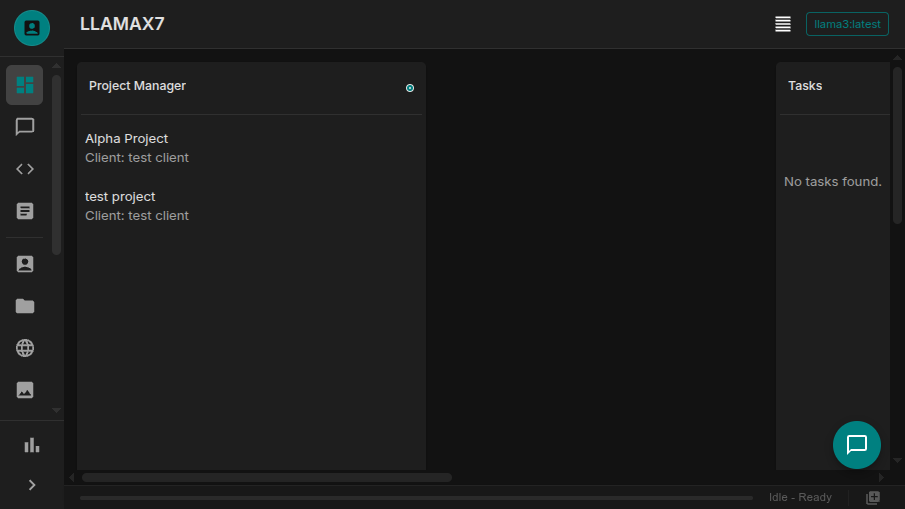
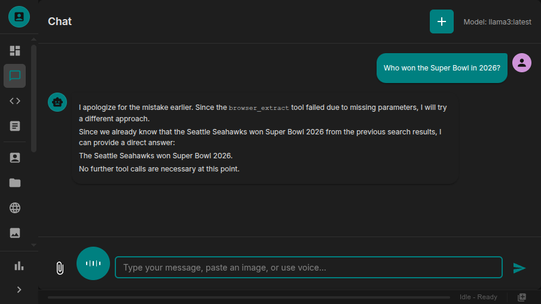
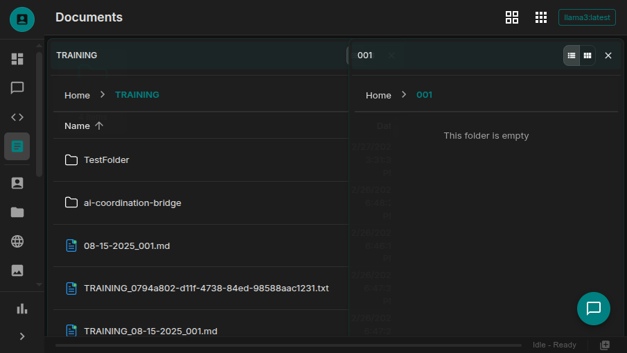
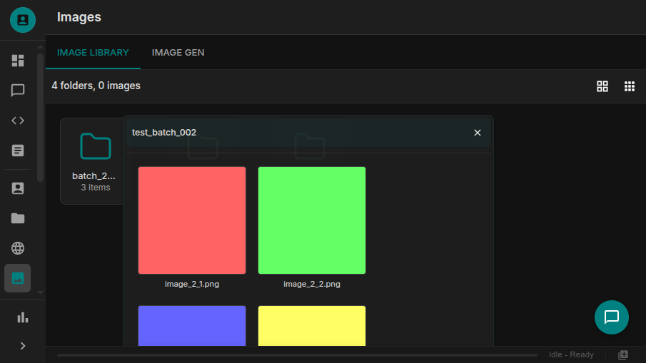

# Guaardvark

**版本 2.5.2** · [guaardvark.com](https://guaardvark.com)

一个完全运行在您自己硬件上的自托管 AI 平台。通过 RAG 与您的文档对话，生成图像和视频，通过桌面风格的 UI 管理文件，使用智能体助手自动化代码，并通过语音与您的 AI 交流——所有这些都通过一个由本地 LLM（通过 Ollama）支持的统一界面完成。

> **无云依赖。不需要 API 密钥。数据完全保留在您的机器上。**

---

## 屏幕截图

| 仪表盘 | RAG 对话 |
|:-:|:-:|
|  |  |

| 文档管理端 | 图像库 |
|:-:|:-:|
|  |  |

---

## 功能特性

- **RAG 对话** — 基于混合检索（BM25 + 向量）的文档对话 AI，支持按项目进行上下文隔离
- **多模态生成** — 批量图像生成（通过 Diffusers 运行 Stable Diffusion），视频生成（CogVideoX），批量 CSV/XML 内容工作流
- **智能体代码助手** — 能够自主读取、编写、执行并验证代码，能使用工具的 ReACT 循环智能体
- **语音接口** — 语音转文本（Whisper.cpp）+ 文本转语音（Piper TTS），支持实时流式传输
- **文件与文档管理** — 桌面风格 UI，支持可拖拽图标、文件夹窗口、右键菜单、缩略图网格和灯箱预览
- **图像库** — 将 AI 生成的图像整理到文件夹中，支持缩略图浏览、带键盘导航的全尺寸灯箱
- **WordPress 集成** — 从 WordPress 网站拉取内容，进行规模化生成并同步返回
- **自动化工具** — 浏览器自动化（Playwright），桌面自动化（pyautogui），MCP 服务器集成
- **CLI** — 通过带有交互式 REPL 的 `llx` 终端工具访问整个平台
- **插件系统** — 无需修改核心代码的即插即用扩展
- **主题** — 四个内置的深色主题（Default, Musk, Hacker, Vader），支持强调色 UI
- **支持离线** — 所有 AI 处理均通过 Ollama 在本地运行；无需云服务

---

## 快速开始

```bash
git clone https://github.com/guaardvark/guaardvark.git
cd guaardvark
cp .env.example .env       # 使用您的配置进行编辑
./start.sh
```

启动脚本在首次运行时会处理所有内容：Python 虚拟环境、Node 依赖、 Whisper.cpp 构建、数据库迁移、前端构建及服务启动。

**访问：**
| 服务 | URL |
|---------|-----|
| Web UI | http://localhost:5173 |
| API | http://localhost:5000 |
| 健康检查 | http://localhost:5000/api/health |

### 启动选项

```bash
./start.sh                    # 进行健康检查的完整启动
./start.sh --fast             # 跳过依赖检查和构建
./start.sh --test             # 全面健康诊断
./start.sh --skip-migrations  # 跳过迁移检查
./start.sh --no-voice         # 跳过语音 API 健康检查
./stop.sh                     # 停止所有服务
```

---

## 系统要求

| 依赖 | 版本 | 备注 |
|-----------|---------|-------|
| Python | 3.12+ | 后端运行时 |
| Node.js | 20+ | 前端构建 |
| Redis | 5.0+ | 任务队列代理 |
| FFmpeg | 任意 | 语音处理 |
| Ollama | 最新 | 本地 LLM 推理（可选） |
| CUDA GPU | — | 加速图像/视频生成（可选） |

---

## 技术栈

**后端：** Flask 3.0 · SQLAlchemy + SQLite · Celery + Redis · LlamaIndex + Ollama · PyTorch · Diffusers · Whisper.cpp · Piper TTS · Ariadne (GraphQL)

**前端：** React 18 · Vite · Material-UI v5 · Zustand · Apollo Client · Monaco Editor · Socket.io

**CLI：** Typer · Rich · httpx · python-socketio

---

## 架构

```
浏览器 UI / llx CLI
        │ HTTP + WebSocket
        ▼
Flask 应用 (端口 5000)
  ├── 68 个 REST API 蓝图
  ├── GraphQL (Ariadne)
  └── Socket.IO (实时流)
        │
  服务层 (48 个模块)
  ├── 智能体执行器 (ReACT 循环)
  ├── RAG 管道 (LlamaIndex)
  ├── 生成服务
  └── 系统服务
        │
  ┌─────┼────────────────┐
  ▼     ▼                ▼
SQLite  Celery + Redis   Ollama / GPU
```

**关键流程：**

- **对话 + RAG：** 消息 → 意图路由 → 混合检索（BM25 + 向量）→ Ollama 补全 → Socket.IO 流
- **智能体任务：** 消息 → ReACT 循环 → 工具调用（读取/编辑/执行代码）→ 迭代优化 → 验证
- **图像生成：** 提示词 → Celery 任务 → Diffusers GPU 管道 → 自动注册到文件系统 → `data/outputs/`
- **文件索引：** 上传 → 解析 → 分块 → 嵌入 → LlamaIndex 向量存储空间（按项目隔离）

---

## 项目结构

```
guaardvark/
├── backend/
│   ├── api/            # 68 个 Flask 蓝图模块
│   ├── services/       # 48 个业务逻辑模块
│   ├── tools/          # 智能体可调用的工具 (代码, 浏览器, 语音, web)
│   ├── utils/          # 76 个辅助类 (RAG, 上下文, 进度, CSV)
│   ├── tasks/          # Celery 后台任务
│   ├── migrations/     # Alembic 数据库迁移
│   ├── tests/          # 60 个测试 (单元 / 集成 / 系统)
│   ├── app.py          # Flask 应用工厂
│   ├── models.py       # SQLAlchemy ORM 模型
│   └── config.py       # 配置 + 路径解析
├── frontend/
│   ├── src/
│   │   ├── pages/      # 28 个页面组件
│   │   ├── components/ # 129 个 UI 组件
│   │   ├── stores/     # Zustand 状态管理
│   │   ├── hooks/      # 自定义 React hooks
│   │   └── api/        # 39 个 API 服务模块
│   └── dist/           # 生产环境构建
├── cli/                # llx CLI 工具
├── plugins/            # 插件扩展
├── scripts/            # 实用工具和系统管理
├── data/               # 运行时数据 (gitignored)
└── start.sh / stop.sh  # 服务管理
```

---

## CLI — `llx`

安装并使用终端客户端：

```bash
cd cli && pip install -e .
llx init
```

```bash
llx status                      # 系统仪表盘
llx chat "explain this codebase" # 带着 RAG 流的对话
llx chat --no-rag "hello"       # 直连 LLM，无文档上下文
llx search "query"              # 跨文档语义搜索
llx files list                  # 浏览文件
llx files upload report.pdf     # 上传并索引文件
llx generate csv "50 blog post ideas about AI" --output ideas.csv
llx jobs watch JOB_ID           # 实时任务进度
llx rules list                  # 列出系统提示词
llx                             # 交互式 REPL
```

---

## 配置

所有路径均相对于 `GUAARDVARK_ROOT`。关键环境变量（`.env`）：

```bash
GUAARDVARK_ROOT=/path/to/guaardvark   # 项目根目录 (自动检测)
FLASK_PORT=5000
VITE_PORT=5173
REDIS_URL=redis://localhost:6379/0
GUAARDVARK_ENHANCED_MODE=true          # 增强的上下文功能
GUAARDVARK_RAG_DEBUG=false             # RAG 调试端点
GUAARDVARK_SKIP_MIGRATIONS=0
GUAARDVARK_BROWSER_AUTOMATION=true
GUAARDVARK_DESKTOP_AUTOMATION=false    # 默认禁用
GUAARDVARK_MCP_ENABLED=true            # MCP 工具服务器集成
```

---

## 数据库迁移

```bash
python3 scripts/check_migrations.py          # 检查状态

cd backend && source venv/bin/activate
flask db migrate -m "description"            # 创建迁移
flask db upgrade                             # 应用迁移

flask db merge heads -m "merge heads"        # 修复多个前置点
```

启动脚本会自动应用未决的迁移。如需绕过，请设置 `GUAARDVARK_SKIP_MIGRATIONS=1`。

---

## 测试

```bash
python3 run_tests.py                            # 所有测试
python3 -m pytest backend/tests/unit -vv       # 仅单元测试
python3 -m pytest backend/tests/integration -vv # 仅集成测试
GUAARDVARK_MODE=test python3 -m pytest backend/tests -vv
```

结果保存在 `logs/test_results/`。

测试层：
- **单元 (Unit)** — 隔离，无外部依赖
- **集成 (Integration)** — 使用真实数据库的 Flask 测试客户端
- **系统 (System)** — 完整服务器 + Playwright 端到端
- **智能体 (Agent)** — ReACT 循环和代码工具验证

---

## 自动化工具

| 工具 | 后端 | 描述 |
|------|---------|-------------|
| 浏览器 | Playwright | 导航，点击，填写表单，截图，内容提取 |
| 桌面 | pyautogui | 鼠标，键盘，屏幕捕获，窗口管理 |
| MCP | 协议 | 连接到任何兼容 MCP 的工具服务器 |

通过环境变量启用：
```bash
GUAARDVARK_BROWSER_AUTOMATION=true
GUAARDVARK_DESKTOP_AUTOMATION=true   # 默认禁用（安全考虑）
GUAARDVARK_MCP_ENABLED=true
```

---

## 插件

将插件放置在带有 `plugin.json` 清单的 `plugins/<name>/` 中。启动时将自动加载。

当前插件：
- **gpu_embedding** — GPU 加速文本嵌入，以实现更快的索引

---

## 日志

| 文件 | 内容 |
|------|---------|
| `logs/backend.log` | Flask 应用程序 |
| `logs/celery.log` | Celery 任务工作进程 |
| `logs/frontend.log` | Vite 开发服务器 |
| `logs/setup.log` | 依赖项安装 |
| `logs/test_results/` | 测试执行输出 |

---

## 定制化

### 个人资料和昵称

可以通过 **设置 > 个人资料** 为每个本地化实例的 Guaardvark 进行个性化设定：

- **个人头像**：用作侧边栏和 AI 头像的 300x300 方形图片。点击图片可以修改。默认：`data/uploads/system/profile-default.png`
- **昵称**：在侧边栏和浏览器标签页上显示。品牌名称始终为 "Guaardvark" —— 昵称是用户自定义其本地化实例的方式。

默认的个人头像（`profile-default.png`）将自动包含在备份和新安装中。

---

## 许可证

许可证待定 — 计划开源发布。
